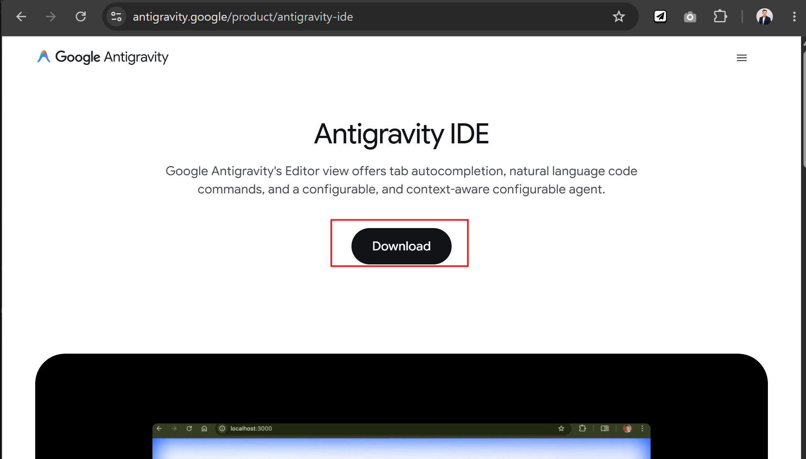
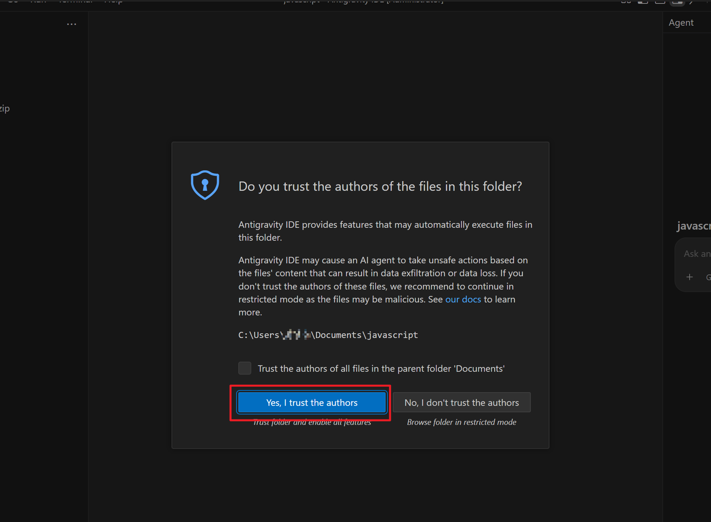
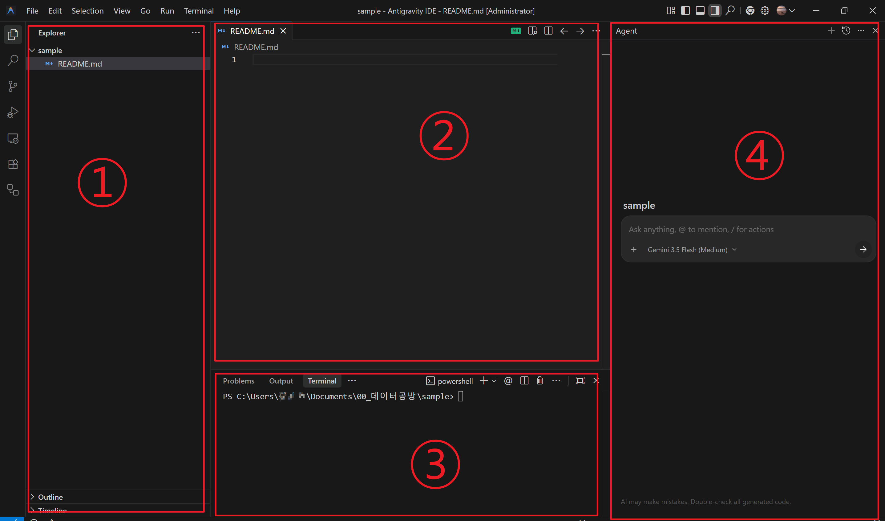
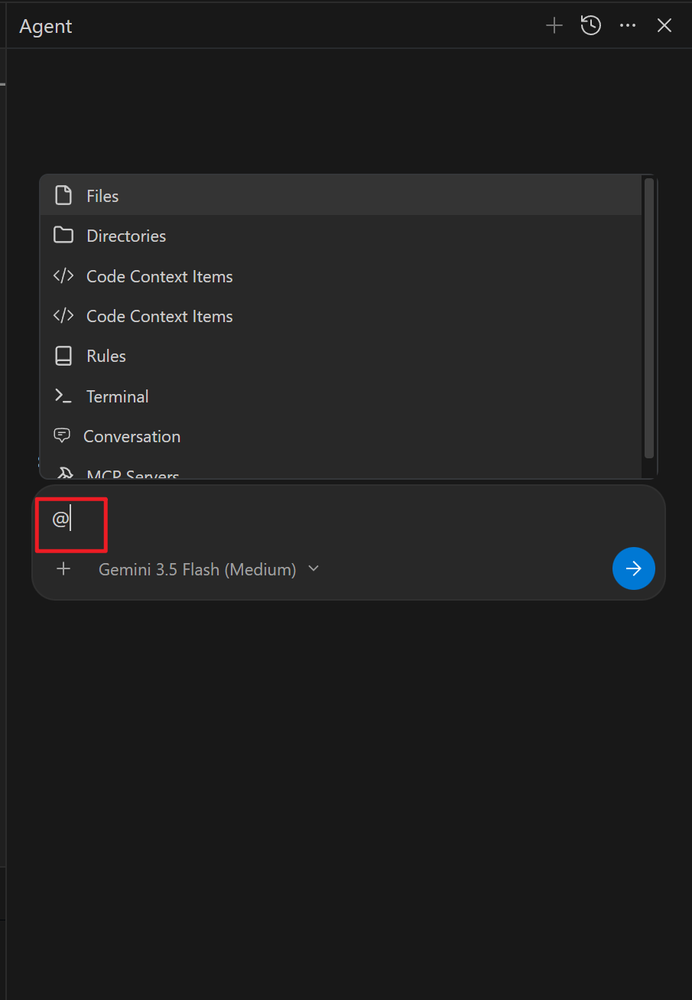
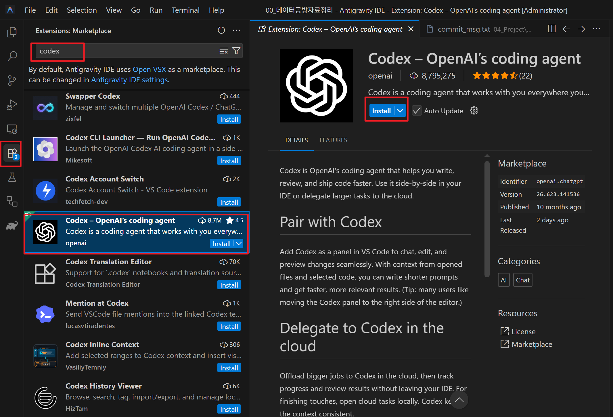
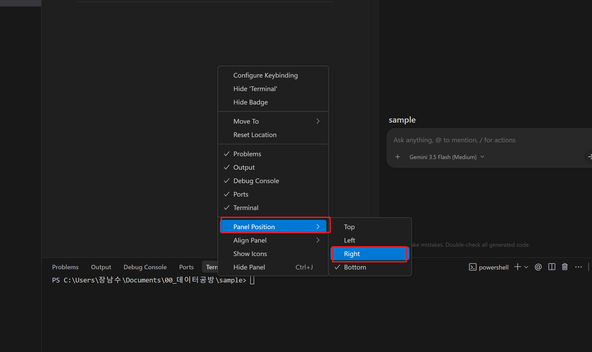
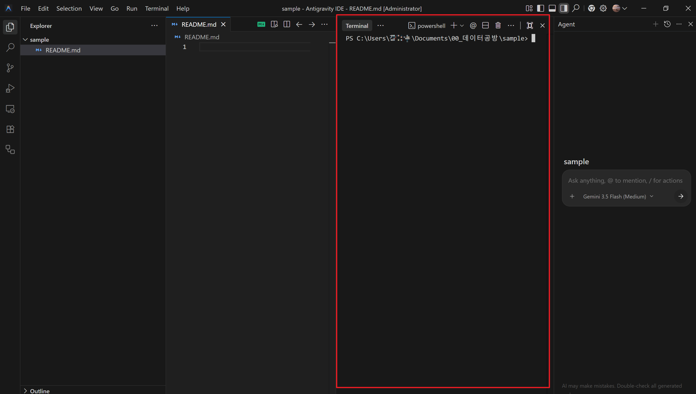

# Google Antigravity 실무 시작 가이드

부제: Antigravity 2.0과 Antigravity IDE 구분부터 Codex 연동까지

초판: 2026-07-16

공식 문서 검증: 2026-07-18

기획·검수: 데이터공방 장남수 · [datagongbang.kr](https://datagongbang.kr)

이 문서는 Google Antigravity를 처음 접하는 실무자가 제품을 혼동하지 않고 설치한 뒤, 작은 작업부터 안전하게 검증하는 과정을 안내합니다. 화면과 제공 모델은 업데이트에 따라 달라질 수 있으므로 제품명이나 버튼 위치보다 **공식 다운로드 페이지, 권한 확인, 변경 검토, 실행 결과 확인**이라는 원칙을 중심으로 설명합니다.

> 데이터공방 장남수는 데이터 분석·업무 자동화·AI 활용 교육 현장에서 “AI가 만들었다”보다 “사람이 검토하고 재현할 수 있다”를 우선합니다. 이 가이드도 설치 → 작은 요청 → 변경 확인 → 테스트의 실무 루프를 기준으로 작성했습니다.

---

## 1. 먼저 구분하기: Antigravity 2.0과 Antigravity IDE

Google의 현재 Antigravity 플랫폼은 네 가지 제품으로 구성됩니다.

| 제품 | 주 용도 | 적합한 사용자 |
|---|---|---|
| **Antigravity 2.0** (`Antigravity`) | 여러 로컬 에이전트를 시작·관찰·조율하는 독립형 지휘 애플리케이션 | 여러 작업이나 프로젝트를 상위 수준에서 관리하려는 사용자 |
| **Antigravity IDE** | 파일 탐색기, 코드 편집기, 터미널, 에이전트 패널을 갖춘 개발 환경 | 코드를 직접 보고 수정·검토하려는 개발자와 실무자 |
| **Antigravity CLI** | 터미널에서 `agy` 명령으로 에이전트와 작업 | 키보드 중심 또는 자동화 워크플로를 선호하는 사용자 |
| **Antigravity SDK** | Antigravity 기능을 프로그램에 통합 | 자체 도구를 만드는 개발자 |

Antigravity 2.0은 “웹 비서”가 아닙니다. Windows, macOS, Linux에 설치하는 독립형 애플리케이션이며 IDE와 별도로 사용할 수 있습니다. 이 문서는 파일과 코드를 직접 확인하는 **Antigravity IDE**를 중심으로 다룹니다.

공식 근거: [Antigravity 시작 Codelab](https://codelabs.developers.google.com/getting-started-google-antigravity), [Antigravity IDE 시작 Codelab](https://codelabs.developers.google.com/getting-started-agy-ide)

## 2. 설치 전 준비

### 2.1 준비물

- 개인 Gmail 계정
- Chrome 브라우저
- 설치 권한이 있는 Windows 10 64비트 이상 PC
- 연습용 프로젝트 폴더
- 인터넷 연결

Windows용 Antigravity IDE는 x64와 ARM64 설치 파일이 구분됩니다. 대부분의 Intel·AMD 기반 PC는 x64입니다. 확실하지 않다면 Windows의 `설정 > 시스템 > 정보 > 시스템 종류`에서 확인합니다.

> Git, Python, Node.js는 모든 Antigravity IDE 작업의 일괄 필수 구성요소가 아닙니다. 작업할 프로젝트가 요구할 때 각각 공식 설치 절차에 따라 준비하세요.

### 2.2 설치 파일 받기

1. 브라우저에서 [Google Antigravity 공식 다운로드](https://antigravity.google/download) 페이지를 엽니다.
2. **Antigravity IDE** 구역으로 이동합니다. Antigravity 2.0 구역과 혼동하지 않습니다.
3. Windows PC의 시스템 종류에 맞춰 **Windows x64** 또는 **Windows ARM64**를 선택합니다.
4. 내려받은 설치 파일의 게시자가 Google인지 확인한 뒤 실행합니다.



보안 경고가 표시되면 무조건 우회하지 말고 파일을 공식 페이지에서 받았는지와 게시자 정보를 먼저 확인합니다. 회사 PC에서는 조직의 보안 정책이나 관리자 승인이 우선입니다.

## 3. 최초 실행과 안전 설정

1. 설치를 마치고 **Antigravity IDE**를 실행합니다.
2. 개인 Google 계정으로 로그인합니다.
3. 화면 테마를 선택합니다.
4. 에이전트 사용 방식 설정에서 처음에는 **Review-driven development**를 선택합니다.
5. 터미널 실행 정책, 산출물 검토 정책, JavaScript 실행 정책을 읽고 본인이 허용할 범위를 정합니다.
6. 확장 프로그램은 당장 필요한 것만 선택합니다. `agy-ide` 명령줄 도구도 필요할 때 설치할 수 있습니다.
7. Google 개발 도구용 플러그인은 선택 사항입니다.

Review-driven development는 초보자가 에이전트의 계획과 변경을 중간에 검토하기 좋은 출발점입니다. 권한을 넓게 주는 설정은 편리하지만 파일 변경과 명령 실행 범위도 커집니다.

공식 근거: [Antigravity IDE 설치 및 초기 설정](https://codelabs.developers.google.com/getting-started-agy-ide)

## 4. 프로젝트 폴더 열기

1. 시작 화면의 **Open Folder**를 선택하거나 `File > Open Folder`를 엽니다.
2. 연습용 폴더 하나를 선택합니다. 처음부터 중요한 운영 프로젝트를 열지 않는 편이 안전합니다.
3. 폴더 신뢰 여부를 묻는 창이 나오면 출처와 내용을 아는 폴더에만 신뢰를 허용합니다.
4. `Terminal > New Terminal`에서 터미널을 열어 현재 경로가 선택한 프로젝트인지 확인합니다.
5. Git 프로젝트라면 작업 전에 `git status`로 기존 변경 사항을 확인합니다.



“신뢰”는 모든 작업을 자동 승인한다는 뜻이 아닙니다. Antigravity의 파일·터미널·브라우저 권한과 검토 정책은 별도로 작동하므로 실행 요청마다 대상과 영향을 확인합니다.

## 5. 화면 익히기



- **Explorer**: 프로젝트의 폴더와 파일을 확인합니다.
- **Editor**: 코드를 직접 읽고 편집하며 Tab 기반 자동완성 도움을 받을 수 있습니다.
- **Terminal**: 빌드, 테스트, Git 같은 프로젝트 명령을 실행합니다. 터미널 자체는 기본적으로 AI 대화창이 아닙니다. Antigravity CLI를 별도로 설치했다면 `agy`로 터미널 대화를 시작할 수 있습니다.
- **Agent panel**: 요청을 입력하고 모델을 선택하며 파일·명령을 참조합니다.
- **Artifacts / Changes**: 계획, 작업 목록, 코드 변경, 검증 결과를 확인하고 의견을 남깁니다.

공식 근거: [Antigravity IDE 개요](https://antigravity.google/docs/ide-overview), [Antigravity IDE 인터페이스](https://codelabs.developers.google.com/getting-started-agy-ide)

## 6. 첫 작업: 작게 요청하고 직접 검증하기

처음에는 복사본이나 연습 저장소에서 다음처럼 범위를 좁혀 요청합니다.

```text
README.md의 오탈자만 찾아줘.
아직 파일은 수정하지 말고, 수정 후보와 근거를 먼저 표로 보여줘.
```

검토 후 다음 요청으로 이어갑니다.

```text
승인한 항목만 수정해줘.
수정 후 변경된 파일과 확인 방법을 알려줘.
```

특정 파일을 다룰 때는 `@README.md`처럼 파일을 참조할 수 있습니다. 파일명이 같은 경우에는 경로를 함께 적습니다.



작업이 끝나면 반드시 다음을 확인합니다.

1. Changes 또는 diff에서 실제 변경 내용을 읽습니다.
2. 의도하지 않은 파일이 바뀌지 않았는지 확인합니다.
3. 프로젝트의 테스트·빌드·린트 명령을 실행합니다.
4. 실행 결과와 남은 위험을 에이전트에게 요약하게 합니다.
5. Git을 사용한다면 검토를 마친 변경만 커밋합니다.

에이전트가 사용하는 모델 목록과 이름은 계정, 출시 시점, 정책에 따라 달라질 수 있습니다. 문서에 특정 모델명을 고정하지 말고 IDE에 실제 표시되는 모델과 설명을 기준으로 선택하세요.

## 7. 반복 업무는 Rules와 Skills로 관리하기

일반 Markdown 파일을 매번 `@`로 첨부하는 방식도 가능하지만, 지속적인 규칙은 Antigravity가 공식 지원하는 구조를 쓰는 편이 명확합니다.

### 7.1 Rules: 프로젝트의 지속 규칙

- 워크스페이스 규칙: `<프로젝트>/.agents/rules/`
- 전역 규칙: `~/.gemini/GEMINI.md`
- IDE의 Agent panel에서 `... > Customizations > Rules`로 관리 가능

Rules에는 코딩 스타일, 수정 금지 영역, 필수 검증 명령처럼 반복 적용할 제약을 적습니다. 적용 방식은 Manual, Always On, Model Decision, Glob 중 목적에 맞게 선택합니다.

### 7.2 Skills: 반복 가능한 작업 절차

```text
.agents/skills/
└── report-check/
    ├── SKILL.md
    ├── scripts/      # 선택
    └── resources/    # 선택
```

Skill은 특정 작업을 수행하는 지침·스크립트·참고자료를 묶은 재사용 가능한 패키지입니다. `SKILL.md`의 YAML frontmatter에는 작업을 식별할 수 있는 `description`을 명확히 적습니다.

공식 근거: [Antigravity Rules](https://antigravity.google/docs/ide-rules), [Antigravity Agent Skills](https://antigravity.google/docs/skills?app=antigravity-ide)

> 데이터공방 실무 원칙: Rules에는 “항상 지킬 기준”을, Skills에는 “반복할 절차”를 둡니다. 예를 들어 개인정보 마스킹은 Rule, 월간 보고서 생성 순서는 Skill로 분리하면 유지보수가 쉬워집니다.

## 8. Codex IDE 익스텐션 연결과 역할

Codex는 OpenAI의 코딩 에이전트입니다. IDE 안에서 코드베이스를 이해하고 파일을 수정하며 명령을 실행하고, 변경 사항을 검토하는 작업을 돕습니다. **Codex 자체가 실시간 린터를 대체하거나 커밋 전에 모든 문법 오류를 자동 차단하는 도구는 아닙니다.** 린트 검사는 프로젝트에 ESLint, Pylint 같은 도구가 설치되어 있고 Codex가 해당 명령을 실행할 때 수행됩니다.

### 8.1 설치 전 확인

Antigravity IDE가 VS Code 호환 확장 프로그램 설치를 지원하더라도, 확장 프로그램별 호환성은 버전과 배포 정책에 따라 달라질 수 있습니다. 설치 화면에서 다음을 확인합니다.

- 이름: **Codex – OpenAI’s coding agent**
- 게시자: **OpenAI**
- 확장 ID: `OpenAI.chatgpt`



### 8.2 설치와 로그인

1. IDE의 Extensions 패널을 엽니다.
2. `OpenAI.chatgpt`를 검색하고 게시자가 OpenAI인지 확인합니다.
3. 설치가 가능하면 **Install**을 선택합니다.
4. Codex 패널의 **Sign in with ChatGPT**로 브라우저 로그인을 완료합니다. 로컬 사용은 API key 방식도 지원하지만 API 사용 요금과 기능 범위가 다릅니다.
5. 프로젝트 폴더를 열고 Codex에 읽기 전용 설명 요청부터 시작합니다.

```text
이 저장소의 구조와 실행 방법을 설명해줘. 아직 파일은 수정하지 마.
```

Codex는 `.codexrc`를 자동 생성하지 않습니다. 공용 프로젝트 지침은 `AGENTS.md`, Codex의 공유 에이전트 설정은 `config.toml`, IDE 전용 동작은 `chatgpt.*` 편집기 설정을 사용합니다.

### 8.3 코드 검토 활용

Git 저장소에서는 Codex 입력창에 `/review`를 입력해 기준 브랜치 또는 미커밋 변경을 검토할 수 있습니다. 검토 결과는 제안이며, 테스트 통과나 결함 부재를 보증하지 않습니다. 결과를 읽고 관련 테스트와 린트 명령을 직접 실행해야 합니다.

공식 근거: [Codex IDE extension](https://developers.openai.com/codex/ide), [Codex 공식 Marketplace 항목](https://marketplace.visualstudio.com/items?itemName=OpenAI.chatgpt)

> 설치 버튼이 없거나 확장이 정상 동작하지 않으면 비공식 확장으로 대체하지 마세요. 공식 지원 편집기에서 Codex IDE extension을 사용하거나, Antigravity IDE의 터미널에서 Codex CLI를 별도로 사용하는 방법을 검토하세요.

## 9. 선택 사항: Claude Code를 터미널에서 사용하기

Claude Code는 Antigravity의 내장 기능이나 익스텐션이 아니라 Anthropic의 별도 터미널형 코딩 에이전트입니다. 동일한 프로젝트에서 여러 에이전트를 동시에 수정 모드로 실행하면 충돌할 수 있으므로 역할과 작업 폴더를 분리합니다.

공식 문서가 안내하는 npm 설치 방식은 Node.js 18 이상이 필요합니다.

```bash
npm install -g @anthropic-ai/claude-code
cd <프로젝트-폴더>
claude
```

Windows에서는 WSL 또는 Git for Windows 환경이 필요할 수 있습니다. 설치 후 `claude doctor`로 상태를 점검하고 화면 안내에 따라 Anthropic 계정 인증을 완료합니다. `sudo npm install -g`는 권장되지 않습니다.

공식 근거: [Anthropic Claude Code 설정](https://docs.anthropic.com/en/docs/claude-code/getting-started)

터미널 패널은 필요하면 우측으로 옮길 수 있습니다.




## 10. 데이터공방 장남수의 실무 체크리스트

### 시작 전

- [ ] 공식 사이트에서 설치 파일을 받았다.
- [ ] Antigravity 2.0과 Antigravity IDE 중 목적에 맞는 제품을 골랐다.
- [ ] 중요한 프로젝트는 Git 커밋 또는 별도 복사본으로 기준점을 만들었다.
- [ ] 회사 데이터와 개인정보를 입력해도 되는지 조직 정책을 확인했다.
- [ ] Review-driven development와 최소 권한으로 시작했다.

### 작업 중

- [ ] 요청 범위와 수정 금지 영역을 명시했다.
- [ ] 계획과 명령을 승인하기 전에 대상과 영향을 읽었다.
- [ ] 여러 AI 도구가 같은 파일을 동시에 수정하지 않게 했다.
- [ ] 비밀키, 고객정보, 원본 데이터가 프롬프트나 로그에 노출되지 않게 했다.

### 완료 전

- [ ] diff에서 변경 파일을 모두 확인했다.
- [ ] 테스트·빌드·린트 결과를 직접 확인했다.
- [ ] 자동 생성 결과의 수치, 링크, 법률·정책 문구를 원문과 대조했다.
- [ ] 변경 이유와 검증 결과를 커밋 메시지나 작업 기록에 남겼다.

이 체크리스트가 데이터공방이 교육과 자동화 프로젝트에서 강조하는 핵심입니다. AI 도구의 가치는 과장된 “완전 자동화”가 아니라, 사람이 기준을 설계하고 결과를 검증할 때 안정적으로 커집니다.

## 11. 문제 해결

### 로그인할 수 없음

- 개인 Gmail 계정인지 확인합니다.
- Chrome의 팝업·리디렉션 차단 여부를 확인합니다.
- 회사 계정은 관리자 정책에 따라 사용할 수 없을 수 있습니다.

### 에이전트가 파일을 수정하지 못함

- 올바른 프로젝트 폴더를 열었는지 확인합니다.
- 파일이 읽기 전용인지 확인합니다.
- Antigravity Settings의 파일 시스템 권한과 검토 정책을 확인합니다.
- 명령을 강제로 우회하기 전에 차단 이유를 먼저 읽습니다.

### 터미널 명령이 실패함

- 터미널의 현재 경로를 확인합니다.
- 프로젝트가 요구하는 Git, Python, Node.js 등의 설치 여부와 버전을 확인합니다.
- 오류 메시지 전체를 읽고, 비밀값을 제거한 뒤 Agent panel로 전달합니다.

제품 오류나 기능 요청은 Antigravity의 `Settings > Provide Feedback`에서 전달할 수 있습니다.

## 공식 자료

- [Google Antigravity 공식 다운로드](https://antigravity.google/download)
- [Google Codelab: Getting Started with Antigravity IDE](https://codelabs.developers.google.com/getting-started-agy-ide)
- [Google Codelab: Getting Started with Google Antigravity](https://codelabs.developers.google.com/getting-started-google-antigravity)
- [Google Antigravity IDE 개요](https://antigravity.google/docs/ide-overview)
- [Google Antigravity Rules](https://antigravity.google/docs/ide-rules)
- [Google Antigravity Agent Skills](https://antigravity.google/docs/skills?app=antigravity-ide)
- [OpenAI Codex IDE extension](https://developers.openai.com/codex/ide)
- [Anthropic Claude Code 설정](https://docs.anthropic.com/en/docs/claude-code/getting-started)

---

데이터공방 장남수 · 데이터 분석, 업무 자동화, 생성형 AI 실무 교육

[datagongbang.kr](https://datagongbang.kr)
