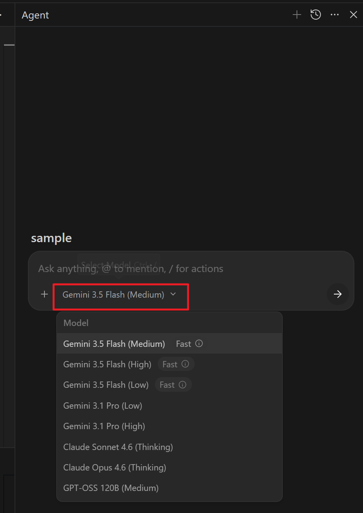

# 안티그래비티 에이전트 및 코덱스 실무 가이드

작성일: 2026-07-16
제작자: 데이터공방 (datagongbang.kr)

이 가이드는 안티그래비티 IDE와 코덱스(Codex) 익스텐션을 설치하고, 실무에서 AI 페어 프로그래밍을 극대화하기 위한 구체적인 사용 요령을 담고 있습니다. 차근차근 읽어보시면서 나만의 AI 비서 환경을 완성해 보세요.

---

▣ 1단계: 안티그래비티 IDE 설치

안티그래비티는 일반적인 단순 챗봇과 달리, 사용자의 로컬 컴퓨터 파일 시스템에 직접 접근하여 코드를 분석하고 터미널 명령어를 실행할 수 있는 차세대 에이전트형 개발 환경(IDE)입니다. 

■ 설치 순서
1. 안티그래비티 공식 릴리즈 페이지에서 본인의 운영체제(Windows용 패키지)에 맞는 설치 파일을 다운로드합니다.
2. 다운로드한 인스톨러 파일을 실행하여 안내에 따라 설치를 완료합니다. (보안 경고 팝업이 뜨면 '실행'을 눌러 넘어가시면 됩니다,,)
3. 최초 실행 시 필수 개발 도구들(Git, Python, Node.js 등)과의 연결을 묻는 팝업이 뜨면 자동으로 설정하기를 선택해 줍니다. 

---

▣ 2단계: 안티그래비티 화면 설명

안티그래비티 IDE의 화면은 실무자가 에이전트와 소통하면서 동시에 코드 변화를 한눈에 볼 수 있도록 정교하게 4개의 영역으로 쪼개져 있습니다. 

■ ① 파일 탐색기 (Explorer Panel)
- 현재 워크스페이스에 열린 프로젝트 파일들을 계층 구조로 보여주며, 파일의 추가/삭제/이동 등을 조작하는 영역입니다. 

■ ② 에디터 작업 공간 (Editor Panel)
- 열어둔 파일의 코드가 표시되며, 사용자가 직접 타이핑하여 소스 코드를 편집하고 가다듬는 메인 에디터 화면입니다. 

■ ③ 로컬 터미널 (Terminal Panel)
- 명령어를 직접 입력하거나, 에이전트가 제안한 명령어(깃 푸시, 빌드, 파이썬 실행 등)가 실행되는 내부 터미널입니다. 

■ ④ 에이전트 대화창 (Agent Panel)
- 안티그래비티 에이전트와 자연어로 대화하며 개발 요구사항을 전달하고 빌드 중에 뜨는 에러 메시지를 함께 토론하며 해결하는 메인 소통 채널입니다. 

---

▣ 3단계: 작업 워크스페이스 폴더 지정 방법

안티그래비티가 내 컴퓨터의 파일을 안전하게 수정하고 빌드 명령을 수행하게 하려면, 명확한 작업 경로를 워크스페이스(Workspace)로 쥐어주어야 합니다. 

■ 설정 방법
1. 안티그래비티 화면 좌측 상단의 [File] -> [Open Workspace] 메뉴를 클릭합니다.
2. 작업하려는 루트 폴더 경로(예: C:/Users/장남수/Documents/00_데이터공방/1_Project/메세지배달부)를 선택하고 열기 버튼을 누릅니다.
3. 에이전트가 최초 구동 시 해당 폴더의 권한을 요청하는 확인 팝업창을 띄우면 반드시 'Yes, I trust the authors'를 눌러주어야 정상 작동합니다. (신뢰 버튼을 누르지 않으면 에이전트가 파일 수정이나 터미널 제어를 하지 못해 먹통이 되니 주의해 주세요,,) 

---

▣ 4단계: LLM 모델 지정 및 질문/변경 방법

안티그래비티는 문제의 난이도와 속도 요구사항에 따라 뇌가 되는 인공지능 모델을 마음대로 갈아 끼울 수 있습니다. 

■ 모델 질문 방법
- 일반적인 코딩 질문은 대화창에 평어로 입력하시면 됩니다. 
- 특정 파일에 대한 대화가 필요할 때는 골뱅이 기호(@)를 입력하고 파일명을 타이핑(예: @README.md)하여 해당 파일의 컨텍스트를 에이전트에게 강제로 주입하며 질문할 수 있습니다. 

■ 모델 변경 방법
- 화면 우측 하단이나 설정 메뉴의 모델 선택 드롭다운 목록에서 원하는 모델을 클릭하여 즉시 변경할 수 있습니다. 
- Gemini 3.5 Flash (Medium): 간단한 디버깅, 스크립트 수정, 빠른 문서 작성 시에 속도가 매우 빨라 실용적입니다. 
- Gemini 3.5 Pro (Large): 아키텍처 재설계, 복잡한 비즈니스 로직 작성 등 깊은 사유와 정확도가 요구될 때 사용하면 훌륭합니다. 

---

▣ 5단계: md 파일을 활용하여 업무 요청/지시 하는 방법

확률적으로 작동하는 LLM의 한계를 뛰어넘어 결정론적이고 일관된 성과를 얻으려면, 마크다운(md) 기반의 지시서 양식(SOP)을 설계해 에이전트에게 쥐어주는 것이 핵심 노하우입니다. 

■ 지시 방법
1. 내 워크스페이스 폴더 안에 `directives` 폴더를 만들고, `SOP_지침서.md` 같은 이름의 지시 문서를 작성합니다. 
2. 문서 안에는 에이전트가 지켜야 할 코딩 규칙, 사용할 라이브러리 제약사항, 예외 처리 원칙 등을 명확히 기술해 둡니다. (마크다운 불릿이나 표를 활용하면 인식을 아주 잘함!)
3. 질문창에 "@SOP_지침서.md 의 규칙을 뼈대로 삼아서 아래 기능을 개발해줘"라고 입력하여 지시서를 에이전트의 컨텍스트에 락(Lock)을 걸어두고 실행시킵니다. 

---

▣ 6단계: 코덱스(Codex)를 익스텐션으로 연결하는 방법

코덱스는 작성된 소스 코드가 문법적으로 올바른지 실시간 린트(Lint) 검사를 수행하고, 깃허브 원격 저장소와 형상 관리가 끊김 없이 이루어지도록 돕는 통합 보안 익스텐션 도구입니다. 

■ 연결 방법
1. 안티그래비티 IDE 좌측 사이드바에서 블록 모양 아이콘인 [Extensions] 메뉴를 클릭합니다.
2. 검색창에 'Codex'를 입력하고 공식 플러그인을 찾아 [Install] 버튼을 누릅니다.
3. 설치가 완료되면 내 깃허브 계정과 코덱스를 연동하는 인증 창이 뜹니다. 인증을 완료해 줍니다. 
4. 프로젝트 루트에 코덱스 규칙 파일(.codexrc)이 자동으로 생성된 것을 확인하면 세팅 완료입니다. 이제 코드가 커밋되기 전에 코덱스가 알아서 문법 결함을 잡아내 주어 실수를 원천 방지해 줍니다. (고생해서 짠 코드가 날아가는 비극을 막아주는 일등공신임,,)
