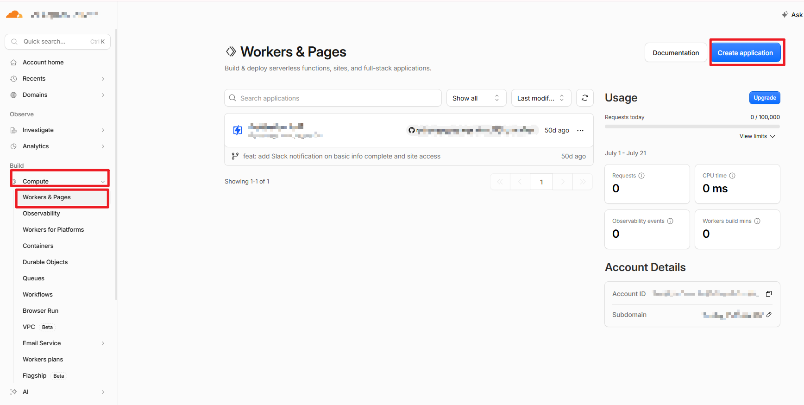
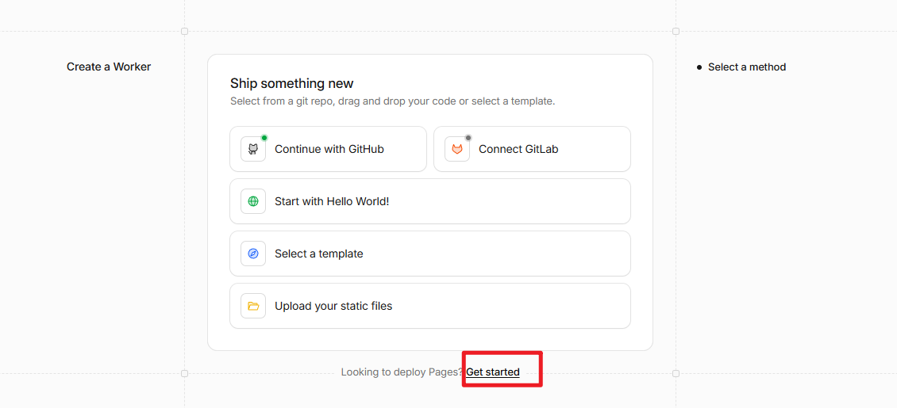
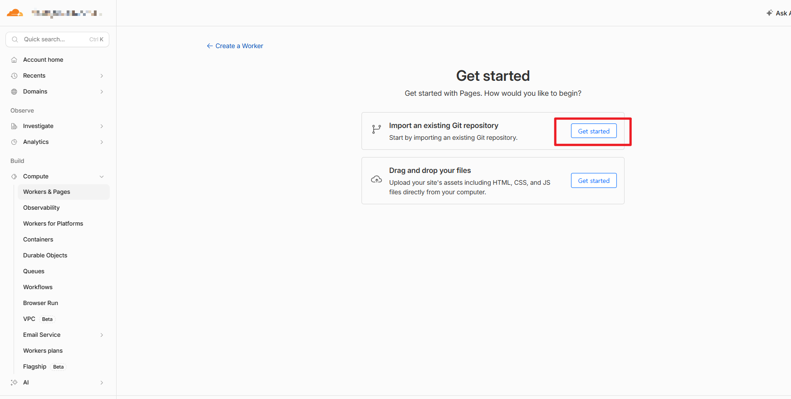
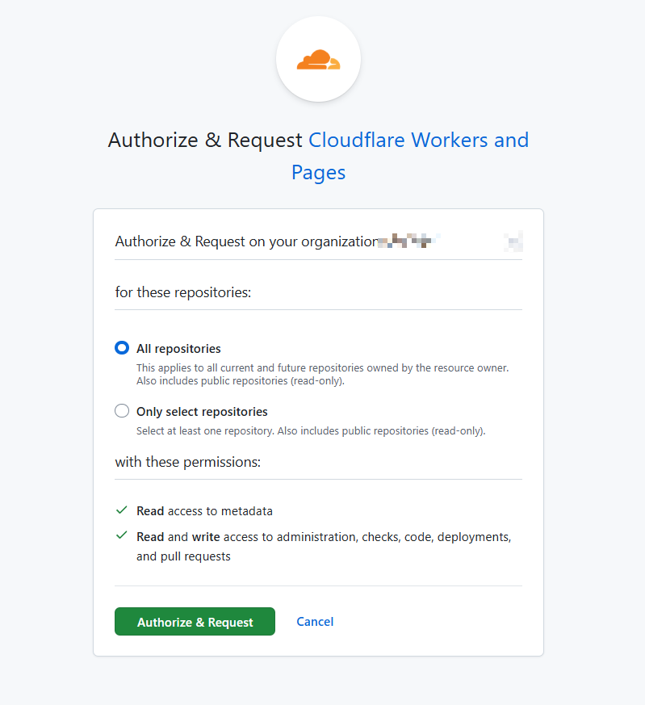
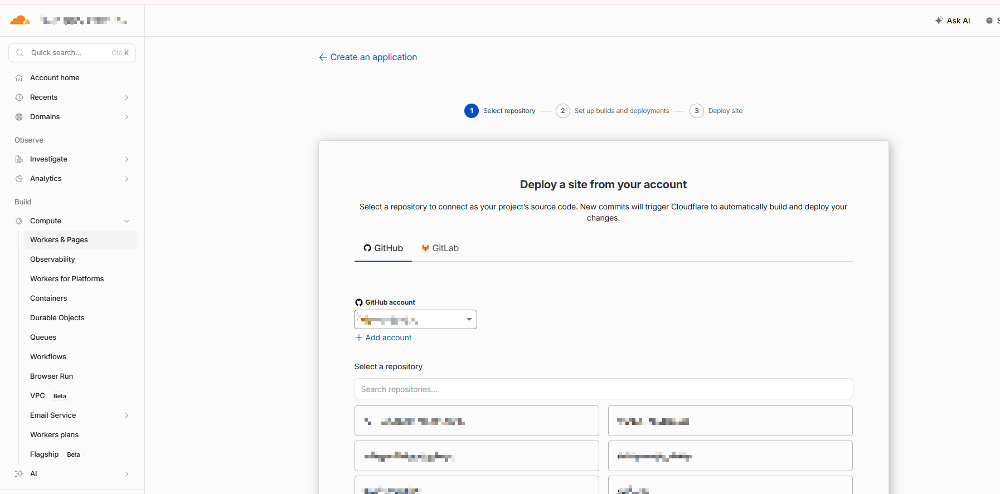
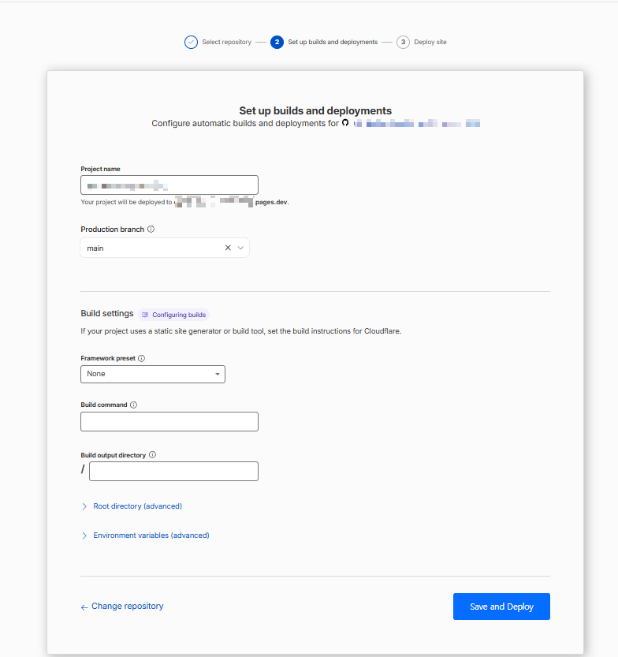
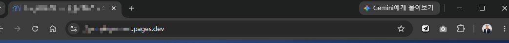

# 내 대시보드 배포하기

부제: GitHub 저장소를 Cloudflare Pages로 연결해 접속 가능한 주소 만들기

초판: 2026-07-21

공식 문서 검증: 2026-07-21

기획·검수: 데이터공방 장남수 · [datagongbang.kr](https://datagongbang.kr)

이 문서는 GitHub 저장소에 올린 대시보드를 **누구나 접속할 수 있는 주소로 띄우는** 과정을 다룹니다. 앞 편에서 만든 저장소가 있다는 전제로 시작합니다. 서버를 직접 빌리거나 관리하지 않고, 코드를 수정해 푸시하면 사이트가 자동으로 갱신되는 구조를 만듭니다.

> 앞 편에서 정리한 흐름을 다시 떠올려 보세요. **AI 도구로 만든다 → Git이 기록한다 → GitHub에 올린다 → Cloudflare가 띄운다.** 지금은 마지막 칸입니다.

<!-- PDF-SKIP-START -->
<div style="display:flex;flex-wrap:wrap;gap:10px;margin:24px 0;">
  <div style="flex:1 1 160px;border:1px solid #E2E8F0;border-radius:10px;padding:14px;background:#FFFFFF;opacity:.6;">
    <div style="font-size:11px;font-weight:700;color:#94A3B8;letter-spacing:.06em;">STEP 1 · 완료</div>
    <div style="font-size:14px;font-weight:700;color:#475569;margin:6px 0 4px;">AI 코딩 도구</div>
    <div style="font-size:12px;color:#94A3B8;line-height:1.55;">대시보드 파일을 만들었다</div>
  </div>
  <div style="flex:1 1 160px;border:1px solid #E2E8F0;border-radius:10px;padding:14px;background:#FFFFFF;opacity:.6;">
    <div style="font-size:11px;font-weight:700;color:#94A3B8;letter-spacing:.06em;">STEP 2 · 완료</div>
    <div style="font-size:14px;font-weight:700;color:#475569;margin:6px 0 4px;">Git</div>
    <div style="font-size:12px;color:#94A3B8;line-height:1.55;">변경 이력을 기록했다</div>
  </div>
  <div style="flex:1 1 160px;border:1px solid #E2E8F0;border-radius:10px;padding:14px;background:#FFFFFF;opacity:.6;">
    <div style="font-size:11px;font-weight:700;color:#94A3B8;letter-spacing:.06em;">STEP 3 · 완료</div>
    <div style="font-size:14px;font-weight:700;color:#475569;margin:6px 0 4px;">GitHub</div>
    <div style="font-size:12px;color:#94A3B8;line-height:1.55;">저장소에 올렸다</div>
  </div>
  <div style="flex:1 1 160px;border:1px solid rgba(2,128,144,.35);border-top:3px solid #028090;border-radius:10px;padding:14px;background:#F1F7F6;">
    <div style="font-size:11px;font-weight:700;color:#028090;letter-spacing:.06em;">STEP 4 · 지금 여기</div>
    <div style="font-size:14px;font-weight:700;color:#0F172A;margin:6px 0 4px;">Cloudflare Pages</div>
    <div style="font-size:12px;color:#475569;line-height:1.55;">접속 가능한 주소를 만든다</div>
  </div>
</div>
<!-- PDF-SKIP-END -->

---

## 1. 배포란 무엇인가

내 PC에서 `index.html`을 더블클릭하면 화면이 뜹니다. 하지만 그건 **나만 볼 수 있는 상태**입니다. 주소창에 `C:\work\...`가 찍혀 있고, 이 주소는 다른 사람의 PC에서는 아무 의미가 없습니다.

배포(deploy)는 그 파일들을 인터넷 어딘가의 서버에 올려 **주소를 가진 웹사이트로 만드는 일**입니다. 배포가 끝나면 `내프로젝트.pages.dev` 같은 주소가 생기고, 링크를 받은 사람은 아무것도 설치하지 않고 브라우저에서 대시보드를 봅니다.

우리가 만들 것은 **정적 사이트**입니다. 서버에서 매번 계산해 페이지를 만들어내는 방식이 아니라, 미리 만들어 둔 HTML·CSS·JS·데이터 파일을 그대로 전달하는 방식입니다. 정적이라는 말 때문에 "움직이지 않는다"고 오해하기 쉬운데, 그렇지 않습니다. **필터, 정렬, 차트, 계산 같은 조작은 브라우저 안에서 얼마든지 동작합니다.** 6장에서 자세히 다룹니다.

정적 사이트는 서버 관리가 필요 없고, 무료 범위가 넓으며, 속도가 빠릅니다. 강의 프로젝트 결과물로는 거의 항상 정답에 가깝습니다.

Cloudflare Pages를 쓰면 흐름은 이렇게 됩니다.

> **GitHub에 푸시 → Cloudflare가 변경을 감지 → 자동으로 배포 → 주소에 즉시 반영**

한 번만 연결해 두면, 이후로는 푸시만 하면 됩니다.

## 2. 배포되는 대시보드의 조건

배포가 안 되는 대부분의 이유는 Cloudflare가 아니라 **파일 구조** 때문입니다. 미리 다섯 가지만 맞춰두면 대부분 한 번에 성공합니다.

**1) 최상위에 `index.html`이 있어야 합니다.** 방문자가 주소로 들어왔을 때 처음 열리는 파일입니다. 이름이 `dashboard.html`이면 첫 화면이 열리지 않습니다.

**2) 경로는 상대경로로 씁니다.** 아래처럼 내 PC 경로가 들어간 코드는 배포 후 반드시 깨집니다.

```

<script src="file:///C:/work/dashboard/chart.js"></script>
```

이렇게 고칩니다.

```

<script src="chart.js"></script>
```

**3) 파일명은 영문 소문자와 하이픈으로 씁니다.** Windows는 대소문자를 구분하지 않지만 배포 서버는 구분합니다. 내 PC에서 `Chart.js`로 저장하고 코드에는 `chart.js`로 적었다면, 내 PC에서는 잘 되다가 배포 후 파일을 찾지 못합니다. **"내 PC에서는 됐는데 배포하면 안 되는" 문제의 절반이 여기서 나옵니다.** 한글 파일명도 피하세요.

**4) 데이터 파일을 함께 올립니다.** 차트가 읽는 CSV나 JSON을 저장소에 같이 넣고 상대경로로 참조합니다. 단, 앞 편에서 강조한 대로 개인정보가 포함된 원본은 넣지 않습니다.

**5) 로컬 서버가 필요한 기능이 있는지 확인합니다.** 파이썬 스크립트를 실행하거나 데이터베이스에 접속하는 기능은 정적 사이트에서 동작하지 않습니다. 대시보드 계산은 브라우저에서 하도록 만들거나, 계산 결과를 미리 파일로 만들어 두어야 합니다.

## 3. Cloudflare 가입과 GitHub 연결

[dash.cloudflare.com](https://dash.cloudflare.com)에서 계정을 만들고 이메일 인증을 마칩니다. 그다음부터가 처음 하는 사람이 가장 많이 헤매는 구간이라 화면을 순서대로 짚습니다.

### 3.1 Workers & Pages 찾아가기

왼쪽 메뉴에서 **Build > Compute > Workers & Pages**로 들어간 뒤, 우측 상단 **Create application**을 선택합니다.



### 3.2 여기서 대부분 헤맵니다: Pages 입구 찾기

**Create application**을 누르면 Pages가 아니라 **Worker를 만드는 화면**이 먼저 나옵니다. `Continue with GitHub`, `Start with Hello World!` 같은 버튼이 보이는 화면입니다. 여기서 GitHub 버튼을 누르면 우리가 원하는 경로가 아닙니다.

화면 **맨 아래**의 작은 문구를 찾으세요.

> `Looking to deploy Pages?` **Get started**



이 링크가 Pages로 들어가는 입구입니다. Cloudflare가 Workers를 앞세우면서 Pages 입구가 작아졌기 때문에, 모르고 들어가면 엉뚱한 화면에서 시간을 보내게 됩니다.

### 3.3 기존 저장소 가져오기

Pages 시작 화면에서 **Import an existing Git repository**의 **Get started**를 선택합니다. 아래쪽 `Drag and drop your files`는 파일을 직접 올리는 방식이라, 자동 재배포가 되지 않습니다. 우리가 원하는 것은 위쪽입니다.



### 3.4 저장소 접근 권한 정하기 (중요)

GitHub 로그인 후 권한 승인 화면이 나옵니다. 여기서 기본값을 그냥 넘기지 마세요.



- **All repositories**: 지금 있는 저장소와 **앞으로 만들 저장소까지 전부** 접근을 허용합니다. 기본값이지만 권장하지 않습니다.
- **Only select repositories**: 지정한 저장소에만 접근합니다. **이쪽을 선택하고 이번에 배포할 저장소만 고르세요.**

권한 목록에 `Read and write access to administration, checks, code, deployments, and pull requests`가 있습니다. 배포와 상태 표시를 위해 필요한 권한이지만, 그만큼 범위를 좁혀두는 편이 안전합니다. 나중에 저장소를 추가할 때 GitHub 설정에서 언제든 늘릴 수 있습니다.

**Authorize & Request**를 선택해 승인을 마칩니다. 회사나 단체 계정(Organization)의 저장소라면 관리자 승인이 필요할 수 있습니다.

### 3.5 저장소 선택

승인이 끝나면 3단계 마법사가 시작됩니다. `1 Select repository → 2 Set up builds and deployments → 3 Deploy site` 순서입니다.

GitHub 계정을 고르고, 목록에서 배포할 저장소를 선택한 뒤 다음으로 넘어갑니다.



비공개(Private) 저장소도 목록에 나오고 그대로 연결됩니다. 배포하기 위해 저장소를 공개로 바꿀 필요는 없습니다.

공식 근거: [Cloudflare Pages Git integration guide](https://developers.cloudflare.com/pages/get-started/git-integration/)

## 4. 첫 배포

저장소를 고르면 마법사 2단계인 **Set up builds and deployments** 화면이 나옵니다. 정적 대시보드는 설정할 것이 거의 없습니다.

| 항목 | 무엇을 넣나 | 정적 대시보드의 경우 |
|---|---|---|
| Project name | 프로젝트 이름 | 저장소 이름 그대로 두면 됨. 입력란 아래에 발급될 주소가 미리 표시됨 |
| Production branch | 실제 서비스로 나갈 브랜치 | `main` |
| Framework preset | 사용한 프레임워크 | **None** |
| Build command | 빌드 명령 | **비워 둠** |
| Build output directory | 결과 파일이 있는 폴더 | 입력란 왼쪽에 `/`가 이미 붙어 있음. 최상위에 `index.html`이 있다면 **비워 둠** |



`Root directory`와 `Environment variables`는 `advanced`로 접혀 있습니다. 지금은 열지 않아도 됩니다.

세 칸(Framework preset, Build command, Build output directory)이 위 화면과 같은 상태인지만 확인하세요. **배포 실패의 대부분은 이 세 칸을 건드려서 생깁니다.** 정적 대시보드는 Cloudflare가 파일을 그대로 전달하기만 하면 되므로, 빌드할 것이 아무것도 없는 상태가 정상입니다.

**Save and Deploy**를 선택하면 배포가 시작됩니다. 로그가 흘러가고 1~2분 안에 완료됩니다.

로그는 무섭게 생겼지만 볼 곳은 정해져 있습니다.

- **Cloning repository** — GitHub에서 파일을 가져오는 중
- **No build command specified** — 정상입니다. 빌드가 필요 없다는 뜻
- **Uploading... files** — 파일 개수가 내 저장소와 비슷한지 확인
- **Success! Deployment complete** — 성공. 바로 위에 `*.pages.dev` 주소가 표시됩니다

주소는 이런 모양입니다. 이 주소를 그대로 공유하면 됩니다.



주소를 눌러 대시보드가 뜨는지 확인합니다. 화면이 하얗게 나온다면 9장의 트러블슈팅으로 가세요.

## 5. 자동 재배포가 작동하는 방식

여기서부터가 이 구조의 진짜 장점입니다. 이제 사이트를 수정하는 방법은 **파일을 고쳐서 푸시하는 것뿐**입니다. Cloudflare 화면에 다시 들어갈 필요가 없습니다.

> **파일 수정 → 커밋 → 푸시 → 1~2분 뒤 사이트에 반영**

여기서 **푸시가 빠지면 아무 일도 일어나지 않습니다.** Cloudflare는 내 PC를 보지 않고 GitHub만 봅니다. 커밋은 내 PC에 기록하는 것까지이므로, 커밋만 하고 푸시를 안 하면 Cloudflare는 변경 사실 자체를 모릅니다. 앞 편 2장에서 다룬 로컬과 클라우드의 구분이 여기서 그대로 이어집니다.

한 번 체감해 보세요. 대시보드 제목을 한 글자 바꾸고 푸시한 뒤 새로고침하면 됩니다. 이 루프가 손에 붙으면 그다음부터는 개발이 아니라 그냥 문서 고치는 감각으로 사이트를 운영하게 됩니다.

Cloudflare는 두 종류의 배포를 만듭니다.

- **프로덕션 배포**: `main` 브랜치에 푸시할 때. 실제 공개 주소에 반영됩니다.
- **프리뷰 배포**: 다른 브랜치에 푸시할 때. 별도의 임시 주소가 생기고 공개 주소는 그대로입니다.

앞 편에서 미뤄뒀던 브랜치가 여기서 쓸모를 갖습니다. **발표 직전에 큰 수정을 시도해야 한다면 브랜치를 만들어 프리뷰 주소에서 먼저 확인**하고, 괜찮을 때만 `main`에 합치면 됩니다. 공개된 주소가 깨진 채로 남는 사고를 막을 수 있습니다.

## 6. 조작 가능한 대시보드로 만들기

정적 사이트에서 어디까지 되는지 헷갈리기 쉬우니 선을 그어 둡니다.

### 6.1 별도 준비 없이 되는 것

브라우저 안에서 실행되는 것은 전부 됩니다.

- 기간·부서·항목 필터, 정렬, 검색
- 차트 종류 전환, 확대, 값 표시
- 입력값을 받아 계산해 보여주는 시뮬레이터
- 표를 CSV로 내려받기
- 화면 크기에 맞춘 반응형 레이아웃

즉 **"조작 가능한 대시보드"에 필요한 기능은 대부분 정적 사이트로 충분합니다.** 데이터가 수천 행 수준이라면 파일로 함께 올려 브라우저에서 처리해도 빠릅니다.

### 6.2 데이터를 갱신하는 두 가지 방법

**방법 A. 데이터 파일을 교체하고 푸시한다.**

가장 단순하고 가장 확실합니다. 매달 갱신되는 대시보드라면 `data/summary.csv`만 새 파일로 바꿔 푸시하면 끝입니다. AI 도구에 "이번 달 데이터로 교체하고 커밋해줘"라고 요청하면 됩니다. 갱신 주기가 일·월 단위라면 이 방법을 권합니다.

**방법 B. 외부에 게시된 데이터를 불러온다.**

구글 스프레드시트를 CSV로 게시하거나 공개 API를 호출해 페이지가 열릴 때마다 최신 데이터를 가져오는 방식입니다. 실시간성이 필요할 때 씁니다. 두 가지를 유의하세요.

- **CORS**: 외부 주소가 다른 사이트에서의 호출을 허용하지 않으면 브라우저가 차단합니다. 콘솔에 CORS 오류가 뜬다면 서버 쪽 허용 설정이 없는 경우입니다.
- **응답 속도와 실패**: 외부 서비스가 느리거나 죽으면 대시보드도 같이 비어 보입니다. 불러오기에 실패했을 때 표시할 문구를 준비해 두세요.

### 6.3 API 키가 필요한 경우 (중요)

유료 API나 인증이 필요한 데이터를 쓰려면 키가 필요합니다. 그런데 **키를 HTML이나 JS 파일에 적으면 그 키는 공개됩니다.** 저장소를 Private로 두더라도 마찬가지입니다. 배포된 사이트의 소스는 누구나 브라우저에서 볼 수 있기 때문입니다.

이때 필요한 것이 **Cloudflare Pages Functions(Workers)** 입니다. 사이트와 외부 API 사이에 아주 작은 중계 코드를 두고, 키는 Cloudflare에 환경 변수로 저장하는 구조입니다. 방문자의 브라우저는 키를 보지 못한 채 결과만 받습니다.

강의 프로젝트 범위에서는 대개 여기까지 갈 필요가 없습니다. **키가 필요한 데이터는 미리 받아 정리한 파일로 올리는 편이 간단하고 안전합니다.** 실시간 연동이 꼭 필요해지는 시점에 Functions를 도입하세요.

## 7. 공유하기 전 점검

- [ ] 휴대폰에서 열어봤다. 표와 차트가 화면 밖으로 넘치지 않는다
- [ ] 대시보드가 읽는 데이터 파일 주소를 직접 열어봤다. **이 파일이 공개돼도 괜찮은 내용인가**
- [ ] 개인 식별 정보(이름, 연락처, 사번, 이메일)가 화면이나 데이터에 남아 있지 않다
- [ ] 소스 보기에서 API 키나 비밀번호가 노출되지 않는다
- [ ] 링크를 다른 사람에게 보내 실제로 열리는지 확인했다

두 번째 항목을 특히 강조합니다. **저장소를 비공개로 두는 것과 배포된 파일이 비공개인 것은 전혀 다릅니다.** 사이트가 읽는 파일은 주소만 알면 누구나 내려받을 수 있습니다.

특정 인원만 접근하게 하고 싶다면 Cloudflare Access로 사이트 앞단에 로그인 관문을 둘 수 있습니다. 사내 자료를 다루는 대시보드라면 이 방식을 검토하세요.

## 8. 참고: GitHub Pages는 어떤가요

GitHub만으로도 정적 사이트를 띄울 수 있습니다(GitHub Pages). 다만 이 가이드는 Cloudflare Pages 하나로 통일합니다. 프리뷰 배포, 접근 제어, 나중에 필요해질 서버 기능(Functions)까지 한 곳에서 이어지기 때문입니다. 두 가지를 동시에 배울 이유는 없습니다.

## 9. 자주 막히는 지점

| 증상 | 원인 | 해결 |
|---|---|---|
| 주소를 열면 404 | 최상위에 `index.html`이 없음 | 파일명과 위치 확인, 출력 디렉터리 설정 확인 |
| 화면이 하얗게 뜸 | 파일 경로 대소문자 불일치 또는 JS 오류 | 브라우저 개발자도구 콘솔의 빨간 오류 확인 |
| 이미지·CSS만 안 나옴 | 절대경로 또는 한글 파일명 | 상대경로와 영문 소문자로 변경 |
| 수정했는데 사이트가 그대로 | **커밋만 하고 푸시를 안 함** | 푸시한다. Cloudflare는 GitHub에 올라온 것만 본다 |
| 푸시했는데 안 바뀜 | 브라우저 캐시 | 강력 새로고침(Ctrl+F5), 그래도 그대로면 배포 로그 확인 |
| 배포가 실패로 표시됨 | 빌드 설정이 정적 사이트와 안 맞음 | Build command를 비우고 preset을 없음으로 |
| 차트만 비어 있음 | 데이터 파일 경로 또는 CORS | 콘솔에서 데이터 요청이 성공했는지 확인 |

콘솔의 오류 메시지를 그대로 AI 도구에 붙여넣고 "이 오류의 원인과 고칠 파일을 알려줘"라고 물으면 대부분 몇 분 안에 해결됩니다.

## 10. 프로젝트 제출 체크리스트

- [ ] `*.pages.dev` 주소로 대시보드가 열린다
- [ ] 필터나 조작 기능이 실제로 동작한다
- [ ] 휴대폰에서도 볼 수 있다
- [ ] 데이터에 개인정보가 없다
- [ ] README에 무엇을 분석한 대시보드인지, 데이터 출처는 어디인지 적었다
- [ ] 파일을 수정해 푸시하면 사이트가 갱신되는 것을 직접 확인했다

마지막 항목까지 확인했다면, 이제 대시보드는 **한 번 만들고 끝나는 산출물이 아니라 계속 갱신할 수 있는 서비스**가 된 것입니다. 이 차이가 포트폴리오에서 가장 크게 작용합니다.

> 부록. 발급받은 `*.pages.dev` 주소는 계속 사용할 수 있습니다. 나중에 보유한 도메인이 생기면 그 주소를 이 사이트에 연결할 수도 있습니다. 절차는 도메인 구입처마다 달라 이 가이드에서는 다루지 않으며, 필요할 때 Cloudflare 공식 문서나 상담을 통해 진행하면 됩니다.

---

## 다음 단계

대시보드를 띄우는 것까지 왔다면, 다음 관심사는 대개 **이 작업을 반복 가능하게 만드는 것**입니다. 매번 같은 지시를 다시 설명하지 않도록 팀의 기준과 절차를 정리하는 방법은 아래 가이드에서 이어집니다.

- 이전 편: [깃허브 처음 시작하기](https://datagongbang.kr/guide/github-start/index.html)
- 심화: [Antigravity Rules & Skills 설계 가이드](https://datagongbang.kr/guide/antigravity-rules-skills/index.html)
- 사내 교육이나 실제 업무 적용이 필요하다면 [데이터공방 교육·도입 상담](https://datagongbang.kr/index.html#contact)으로 문의하세요.
