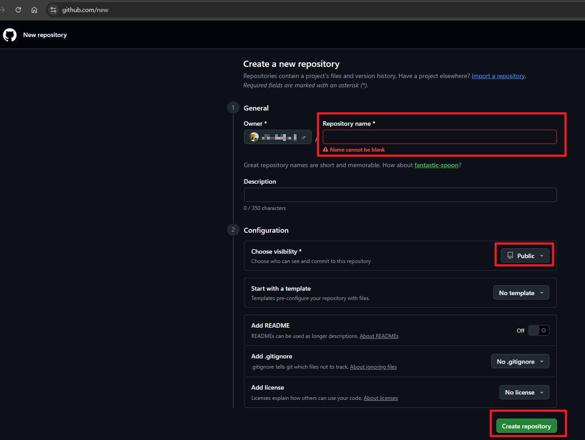
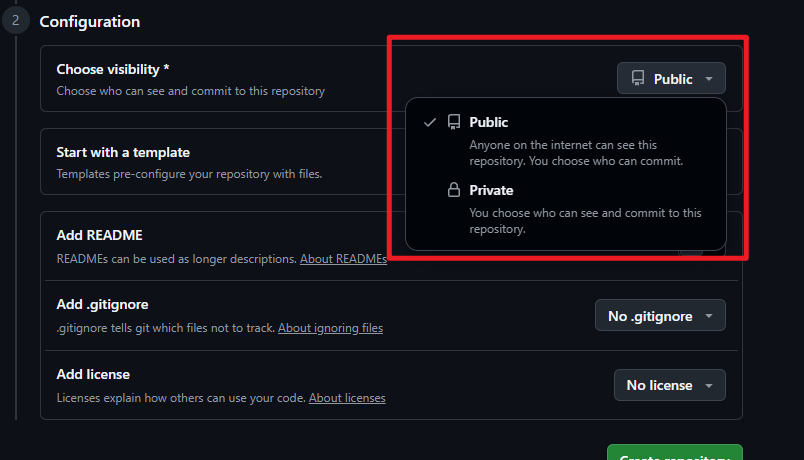

# 깃허브 처음 시작하기

부제: AI 도구, Git, GitHub, Cloudflare가 각각 무슨 일을 하는지부터

초판: 2026-07-21

공식 문서 검증: 2026-07-21

기획·검수: 데이터공방 장남수 · [datagongbang.kr](https://datagongbang.kr)

이 문서는 Git을 한 번도 써 본 적 없는 실무자가 **자신이 만든 대시보드를 인터넷 주소로 공유하기까지**의 첫 절반을 다룹니다. 명령어를 외우는 대신 이미 쓰고 있는 AI 코딩 도구에게 요청하는 방식으로 진행하되, **그 도구가 무엇을 실행하는지 읽고 승인할 수 있는 수준**까지는 반드시 이해하고 넘어갑니다.

> 이 가이드는 "AI가 알아서 해줬다"가 아니라 "내가 무엇을 왜 했는지 설명할 수 있다"를 목표로 합니다. 강의 프로젝트는 결과물보다 과정을 설명할 수 있을 때 실무로 이어집니다.

---

## 0. 도구가 네 개나 나오는데, 뭐가 뭔가요

가장 먼저 막히는 지점은 설치가 아니라 **이름**입니다. 안티그래비티, Git, 깃허브, 클라우드플레어가 한꺼번에 등장하는데 서로 무슨 관계인지 알 수 없기 때문입니다.

다음 한 가지 상황으로 끝까지 갑니다.

> 설문 응답 데이터를 정리해 대시보드를 만들었다. 이걸 팀장님과 외부 심사위원에게 **링크 하나로** 보여줘야 한다.

이 상황에서 네 도구는 등장하는 순서가 다릅니다.

| 도구 | 한 줄 정체 | 이 상황에서 맡는 일 | 비유 |
|---|---|---|---|
| **AI 코딩 도구** (Antigravity IDE, Codex, Claude Code) | 내 PC에서 파일을 직접 만들고 고쳐주는 조수 | 대시보드 HTML과 차트 코드를 작성·수정 | 옆자리에서 대신 타이핑해 주는 조수 |
| **Git** | 내 PC 폴더의 변경 이력을 기록하는 프로그램 | 언제 무엇을 왜 바꿨는지 저장, 잘못되면 되돌리기 | 작업일지 겸 되돌리기 버튼 |
| **GitHub** | Git 기록을 온라인에 두고 공유하는 서비스 | 코드를 인터넷에 보관하고, 다른 서비스가 가져갈 수 있게 열어둠 | 작업일지째 올려두는 공용 창고 |
| **Cloudflare Pages** | 저장소의 파일을 실제 웹사이트로 띄우는 서비스 | `내프로젝트.pages.dev` 주소 발급과 자동 갱신 | 창고의 물건을 진열해 파는 매장 |

정리하면 흐름은 하나입니다.

<!-- PDF-SKIP-START -->
<div style="display:flex;flex-wrap:wrap;gap:10px;margin:24px 0;">
  <div style="flex:1 1 160px;border:1px solid #E2E8F0;border-top:3px solid #028090;border-radius:10px;padding:14px;background:#F8FAFC;">
    <div style="font-size:11px;font-weight:700;color:#028090;letter-spacing:.06em;">STEP 1 · 만든다</div>
    <div style="font-size:14px;font-weight:700;color:#0F172A;margin:6px 0 4px;">AI 코딩 도구</div>
    <div style="font-size:12px;color:#64748B;line-height:1.55;">내 PC에서 대시보드 파일을 만들고 고친다</div>
  </div>
  <div style="flex:1 1 160px;border:1px solid #E2E8F0;border-top:3px solid #028090;border-radius:10px;padding:14px;background:#F8FAFC;">
    <div style="font-size:11px;font-weight:700;color:#028090;letter-spacing:.06em;">STEP 2 · 기록한다</div>
    <div style="font-size:14px;font-weight:700;color:#0F172A;margin:6px 0 4px;">Git</div>
    <div style="font-size:12px;color:#64748B;line-height:1.55;">무엇을 왜 바꿨는지 이력으로 남긴다</div>
  </div>
  <div style="flex:1 1 160px;border:1px solid #E2E8F0;border-top:3px solid #028090;border-radius:10px;padding:14px;background:#F8FAFC;">
    <div style="font-size:11px;font-weight:700;color:#028090;letter-spacing:.06em;">STEP 3 · 올린다</div>
    <div style="font-size:14px;font-weight:700;color:#0F172A;margin:6px 0 4px;">GitHub</div>
    <div style="font-size:12px;color:#64748B;line-height:1.55;">기록을 온라인 저장소에 보관한다</div>
  </div>
  <div style="flex:1 1 160px;border:1px solid #E2E8F0;border-top:3px solid #94A3B8;border-radius:10px;padding:14px;background:#FFFFFF;">
    <div style="font-size:11px;font-weight:700;color:#64748B;letter-spacing:.06em;">STEP 4 · 띄운다</div>
    <div style="font-size:14px;font-weight:700;color:#0F172A;margin:6px 0 4px;">Cloudflare Pages</div>
    <div style="font-size:12px;color:#64748B;line-height:1.55;">접속 가능한 주소를 만든다 (다음 편)</div>
  </div>
</div>
<!-- PDF-SKIP-END -->

> **AI 도구로 만든다 → Git이 기록한다 → GitHub에 올린다 → Cloudflare가 띄운다**

네 개를 동시에 배우려 하지 마세요. 이 문서는 앞의 세 개까지만 다루고, 마지막 Cloudflare는 다음 편에서 이어집니다.

### 0-1. 구글드라이브나 네이버클라우드로 하면 안 되나요

가장 많이 나오는 질문이고, 타당한 질문입니다. 결론부터 말하면 **더 좋고 나쁨의 문제가 아니라 용도가 다릅니다.**

| 비교 항목 | 구글드라이브·네이버클라우드 | GitHub |
|---|---|---|
| 저장하는 단위 | 파일 통째로 덮어쓰기 | 어느 줄이 어떻게 바뀌었는지 |
| 되돌리기 | 최근 버전 일부 | 맨 처음까지 전부, 바꾼 이유와 함께 |
| 여러 명이 같이 수정 | 충돌하면 사본이 하나 더 생김 | 변경분을 합치고, 겹친 부분을 표시해 줌 |
| 웹사이트로 띄우기 | 되지 않음 | 배포 서비스가 그대로 연결됨 |

한 줄로 남기면 이렇습니다.

> **드라이브는 파일을 보관하는 곳이고, GitHub는 코드를 돌아가게 만드는 곳입니다.**

실제로 이렇게 확인할 수 있습니다. 드라이브에 `대시보드.html`을 올리고 공유 링크를 보내면, 상대방 화면에는 대시보드가 열리는 대신 **파일 다운로드 화면**이 뜹니다. 파일을 받아 열어도 옆에 있어야 할 CSV나 이미지 경로가 끊겨 빈 화면이 나오기 쉽습니다. 드라이브는 파일을 건네주는 도구이지 사이트를 실행해 주는 도구가 아니기 때문입니다.

또 하나, 실무에서 더 크게 체감되는 차이는 **되돌리기의 정확도**입니다. 드라이브는 "어제 오후 버전"으로 돌아갈 수 있지만, GitHub는 "차트 색상 바꾼 그 변경만" 되돌릴 수 있습니다.

### 0-2. Git과 GitHub는 같은 건가요

다릅니다. 이름이 비슷해서 생기는 오해입니다.

- **Git**: 내 PC에 설치하는 프로그램입니다. 인터넷 없이도 동작하며, 폴더의 변경 이력을 기록합니다.
- **GitHub**: 그 기록을 올려두고 공유하는 웹 서비스입니다. 회원가입이 필요합니다.

> **Git이 카메라라면, GitHub는 찍은 사진을 올리는 앨범 서비스입니다.**

카메라 없이 앨범만 쓸 수 없고, 앨범 서비스는 GitHub 말고 GitLab 같은 다른 선택지도 있습니다. 이 가이드는 가장 널리 쓰이고 배포 서비스와 연결이 쉬운 GitHub를 기준으로 합니다.

### 0-3. 그럼 안티그래비티는 왜 필요한가요

Antigravity, Codex, Claude Code는 **GitHub와 경쟁하는 서비스가 아닙니다.** 만드는 쪽(내 PC)과 보관·배포하는 쪽(온라인)은 역할 자체가 다릅니다.

이 가이드에서 AI 코딩 도구가 맡는 실제 역할은 두 가지입니다.

1. 대시보드 코드를 작성하고 수정한다.
2. **Git 설치, 설정, 업로드 명령을 대신 실행한다.**

두 번째 덕분에 명령어를 외울 필요가 없습니다. 대신 반드시 갖춰야 할 능력이 하나 생깁니다.

> **AI가 실행하려는 명령을 읽고 승인할 줄 알아야 합니다.**

무엇을 확인해야 하는지는 5장에서 도구별로 정리합니다.

---

## 1. Git을 쓰는 진짜 이유

파일명으로 버전을 관리해 본 사람이라면 이런 폴더를 본 적이 있을 겁니다.

- `분석_최종.xlsx`
- `분석_최종_수정.xlsx`
- `분석_진짜최종_v3.xlsx`
- `분석_진짜최종_v3_팀장님피드백반영.xlsx`

이 방식의 문제는 파일이 많아지는 것이 아니라 **세 가지 정보가 사라진다**는 점입니다.

1. **무엇이 바뀌었는지** 알 수 없다. 열어서 눈으로 비교해야 한다.
2. **왜 바꿨는지** 알 수 없다. 3주 뒤의 나는 기억하지 못한다.
3. **되돌릴 수 없다.** 어느 파일이 정답인지 확신할 수 없다.

Git은 저장할 때마다 이 세 가지를 함께 기록합니다. 바뀐 내용, 바꾼 이유(메시지), 바꾼 시점입니다. 그래서 파일명은 계속 `index.html` 하나로 두고, 이력은 따로 쌓입니다.

흐름은 이렇습니다.

> **작업 폴더에서 수정 → 커밋으로 기록 → 푸시로 GitHub에 전송**

## 2. 로컬과 클라우드, 그리고 커밋·푸시·풀

여기가 이 가이드에서 가장 중요한 장입니다. 이 그림 하나만 머리에 남으면 나머지는 따라옵니다.

### 2.1 같은 프로젝트가 두 곳에 있습니다

Git으로 일할 때는 **내 프로젝트가 두 군데에 각각 존재**합니다.

- **로컬(Local)**: 내 PC의 작업 폴더. 인터넷이 끊겨도 작업할 수 있는 곳.
- **원격(Remote)**: GitHub에 있는 저장소. 흔히 말하는 클라우드.

여기서 초보자가 가장 크게 오해하는 지점이 있습니다.

> **두 곳은 자동으로 동기화되지 않습니다.**

구글드라이브나 네이버클라우드는 파일을 저장하면 알아서 올라갑니다. Git은 다릅니다. **내가 "지금 올려라"라고 명시적으로 지시해야** 원격에 반영됩니다.

불편해 보이지만 이건 의도된 설계입니다. 드라이브는 저장하는 순간 미완성 상태까지 전부 올라가지만, Git은 **내가 완성했다고 판단한 것만 골라서** 올립니다. 실험하다 망가진 코드가 공유 저장소에 자동으로 퍼지는 일이 없습니다.

### 2.2 두 공간을 오가는 세 가지 동작

<!-- PDF-SKIP-START -->
<div style="margin:24px 0;border:1px solid #E2E8F0;border-radius:12px;padding:20px;background:#F8FAFC;">
  <div style="display:flex;flex-wrap:wrap;gap:14px;align-items:stretch;">
    <div style="flex:1 1 220px;border:1px solid #CBD5E1;border-top:3px solid #64748B;border-radius:10px;padding:14px;background:#FFFFFF;">
      <div style="font-size:11px;font-weight:700;color:#64748B;letter-spacing:.06em;">로컬 · 내 PC</div>
      <div style="font-size:14px;font-weight:700;color:#0F172A;margin:6px 0 8px;">작업 폴더</div>
      <div style="font-size:12px;color:#475569;line-height:1.6;">파일을 수정하고 <b>커밋</b>으로 기록을 쌓는 곳. 여기까지는 인터넷이 필요 없습니다.</div>
      <div style="margin-top:10px;padding:8px 10px;border-radius:6px;background:#F1F5F9;font-size:12px;color:#0F172A;"><b>커밋</b> · 로컬 안에서만 일어남</div>
    </div>
    <div style="flex:0 0 130px;display:flex;flex-direction:column;justify-content:center;gap:10px;min-width:130px;">
      <div style="text-align:center;padding:8px 6px;border-radius:8px;background:#028090;color:#FFFFFF;font-size:12px;font-weight:700;">푸시 (push) →</div>
      <div style="text-align:center;padding:8px 6px;border-radius:8px;background:#FFFFFF;border:1px solid #028090;color:#028090;font-size:12px;font-weight:700;">← 풀 (pull)</div>
    </div>
    <div style="flex:1 1 220px;border:1px solid rgba(2,128,144,.35);border-top:3px solid #028090;border-radius:10px;padding:14px;background:#FFFFFF;">
      <div style="font-size:11px;font-weight:700;color:#028090;letter-spacing:.06em;">클라우드 · GitHub</div>
      <div style="font-size:14px;font-weight:700;color:#0F172A;margin:6px 0 8px;">원격 저장소</div>
      <div style="font-size:12px;color:#475569;line-height:1.6;">푸시한 기록이 쌓이는 곳. 다른 PC와 동료, 그리고 배포 서비스가 여기를 봅니다.</div>
      <div style="margin-top:10px;padding:8px 10px;border-radius:6px;background:#F1F7F6;font-size:12px;color:#0F172A;"><b>Cloudflare가 읽는 곳</b></div>
    </div>
  </div>
</div>
<!-- PDF-SKIP-END -->

> 로컬(내 PC)에서 **커밋**으로 기록을 쌓고, **푸시**로 GitHub에 올리고, **풀**로 GitHub의 변경을 내려받습니다. 커밋은 로컬 안에서만 일어나는 일이라 그 자체로는 GitHub에 아무것도 올라가지 않습니다.

| 동작 | 어디서 어디로 | 언제 쓰나 | 비유 |
|---|---|---|---|
| **커밋 (commit)** | 로컬 안에서 (이동 없음) | 의미 있는 작업을 마칠 때마다 | 작업일지에 한 줄 적기 |
| **푸시 (push)** | 로컬 → 클라우드 | 커밋 몇 개를 모아 올릴 때 | 서류철을 창고로 옮기기 |
| **풀 (pull)** | 클라우드 → 로컬 | 작업을 시작하기 전 | 창고의 최신 서류를 가져오기 |
| **클론 (clone)** | 클라우드 → 로컬 (최초 1회) | 다른 PC에서 처음 시작할 때 | 창고에서 서류철 통째로 꺼내오기 |

클론과 풀은 방향이 같지만 쓰는 때가 다릅니다. **클론은 처음 한 번**, **풀은 그 뒤로 계속**입니다.

### 2.3 "커밋했는데 왜 GitHub에 없죠?"

처음 하는 사람의 90%가 겪는 상황입니다. 답은 간단합니다.

> **커밋은 로컬에 기록하는 것까지입니다. 푸시해야 GitHub에 올라갑니다.**

커밋만 하고 푸시를 안 하면 기록은 내 PC 안에만 쌓여 있습니다. GitHub 저장소 화면을 아무리 새로고침해도 보이지 않고, Cloudflare도 변화를 감지하지 못해 사이트가 그대로입니다.

**배포한 사이트가 안 바뀐다면 가장 먼저 "푸시했나?"를 확인하세요.** 배포 편에서 다시 나오는 이야기입니다.

### 2.4 풀은 언제 필요한가요

혼자 PC 한 대로만 작업한다면 풀 쓸 일이 거의 없습니다. 하지만 아래 상황에서는 반드시 필요합니다.

- **PC가 두 대일 때**: 회사에서 푸시하고 집에서 이어서 작업한다면, 시작 전에 풀부터 해야 합니다.
- **GitHub 웹에서 직접 고쳤을 때**: README를 브라우저에서 수정하는 경우가 흔한데, 이때 원격에만 새 기록이 생깁니다.
- **여러 명이 함께할 때**: 동료가 올린 변경을 받아와야 합니다.

풀을 건너뛰고 작업하면 **로컬과 원격이 서로 다른 방향으로 갈라집니다.** 이 상태에서 푸시하면 Git이 거부합니다. 그래서 습관을 이렇게 잡는 편이 안전합니다.

> **작업 시작 전에 풀, 작업 끝나고 커밋, 그리고 푸시.**

### 2.5 브랜치는 나중에

**브랜치(branch)** 는 원본을 건드리지 않고 갈라서 실험하는 선입니다. 혼자 실습하는 동안은 몰라도 됩니다. 배포 편에서 "발표 전에 안전하게 시험해 보는 방법"으로 다시 나옵니다.

---

## 3. GitHub 가입하기

1. [github.com](https://github.com)에 접속해 **Sign up**을 선택합니다.
2. 이메일, 비밀번호, 사용자명(Username)을 입력합니다.
3. 가입 확인 메일의 인증 코드를 입력합니다.
4. 요금제 선택 화면에서는 무료(Free)로 시작하면 됩니다. 이 가이드의 모든 내용은 무료 플랜에서 가능합니다.
5. 로그인 후 설정에서 **2단계 인증(2FA)** 을 켭니다.

사용자명을 정할 때 두 가지만 유의하세요.

- 사용자명은 저장소 주소에 그대로 들어갑니다. `github.com/사용자명/저장소이름` 형태로 외부에 노출됩니다.
- 실습·포트폴리오 용도라면 회사 계정보다 **개인 계정**으로 시작하는 편이 안전합니다. 회사 코드와 개인 실습이 한 계정에 섞이면 나중에 정리하기 어렵습니다.

2단계 인증은 선택이 아니라 사실상 필수입니다. GitHub는 명령줄에서 접근할 때 비밀번호 대신 토큰이나 브라우저 인증을 요구하는데, 2단계 인증이 켜져 있어야 이 과정이 정상적으로 이어집니다.

## 4. 저장소 만들기와 Public / Private 판단

### 4.1 저장소 만들기

1. 우측 상단 **+** 버튼에서 **New repository**를 선택합니다.
2. **Repository name**에 영문 소문자와 하이픈으로 이름을 짓습니다. 예: `survey-dashboard`
3. **Choose visibility**에서 **Public** 또는 **Private**를 선택합니다. 판단 기준은 아래에서 다룹니다.
4. **Add README**를 켭니다. 프로젝트 설명이 담기는 첫 문서이고, 저장소가 비어 있지 않게 해 줍니다.
5. **Add .gitignore**에서 필요한 템플릿을 고릅니다. 올리지 말아야 할 파일을 걸러 주는 목록입니다.
6. **Create repository**를 선택합니다.



`Start with a template`과 `Add license`는 지금 단계에서 건드리지 않아도 됩니다.

`.gitignore`는 실무에서 가장 중요한 안전장치입니다. 여기에 적힌 파일은 **커밋 대상에서 아예 제외**됩니다. 원본 데이터 폴더, 개인 설정 파일, 키가 담긴 파일을 미리 적어두면 실수로 올라가는 사고를 줄일 수 있습니다.

### 4.2 Public과 Private의 차이

`Choose visibility`를 열면 두 선택지의 설명이 함께 표시됩니다.



| 비교 항목 | Public (공개) | Private (비공개) |
|---|---|---|
| 코드를 볼 수 있는 사람 | 인터넷의 누구나 | 나와 내가 초대한 사람만 |
| 검색 노출 | 검색엔진에 노출될 수 있음 | 노출되지 않음 |
| 무료 플랜 사용 | 가능 | 가능 (인원 제한 없음) |
| Cloudflare Pages 배포 연결 | 가능 | **가능** |
| 나중에 변경 | 설정에서 전환 가능 | 설정에서 전환 가능 |

여기서 오해 하나를 먼저 풀어야 합니다.

> **배포하려면 Public이어야 한다는 말은 사실이 아닙니다.** Cloudflare Pages는 비공개 저장소도 연결해 배포할 수 있습니다.

그래서 판단 기준은 배포 가능 여부가 아니라 **코드를 남에게 보여줄 생각이 있는가**입니다.

- 포트폴리오로 코드까지 보여주고 싶다 → Public
- 결과물 사이트만 공유하고 코드는 닫아두고 싶다 → Private
- 판단이 어렵다 → **Private로 시작하세요.** Private를 Public으로 바꾸는 것은 언제든 가능하지만, 반대 방향은 이미 퍼진 내용을 되돌리지 못합니다.

### 4.3 반드시 지켜야 할 두 가지

**첫째, 공개 저장소는 코드뿐 아니라 함께 올린 데이터 파일도 전부 공개됩니다.**

설문 응답 원본, 고객 명단, 사번이나 연락처가 들어간 CSV는 올리지 않습니다. 실습에는 개인 식별 정보를 지운 익명화 데이터나 샘플 데이터를 사용하세요.

여기서 한 걸음 더 나갑니다. 저장소를 Private로 두더라도 **배포한 사이트에 포함된 데이터 파일은 주소만 알면 누구나 내려받을 수 있습니다.** 사이트가 `data/responses.csv`를 읽어 차트를 그린다면, 그 파일은 브라우저에서 직접 열립니다. 저장소 공개 여부와 배포된 파일의 공개 여부는 별개입니다.

**둘째, 한 번 올린 것은 지워도 이력에 남습니다.**

API 키나 비밀번호를 실수로 올렸다면 파일을 지우고 다시 커밋하는 것으로 끝나지 않습니다. 이전 커밋에 값이 그대로 남아 있습니다. 이 경우 유일하게 확실한 조치는 **해당 키를 즉시 폐기하고 새로 발급받는 것**입니다. 이력 삭제는 그다음 문제입니다.

### 4.4 용량 제한

| 항목 | 기준 |
|---|---|
| 파일 하나 | 50MiB 초과 시 경고, **100MiB 초과 시 업로드 차단** |
| 브라우저로 직접 업로드 | 25MiB까지 |
| 저장소 전체 | 1GB 미만 권장, 5GB 미만 강력 권장 |

정리하면 **GitHub는 코드를 두는 곳이지 대용량 데이터를 두는 곳이 아닙니다.** 원본 데이터가 수백 MB라면 저장소에는 집계·요약본만 넣고, 원본은 `.gitignore`로 제외하세요. 대시보드에 필요한 것은 대개 원본 전체가 아니라 집계된 결과입니다.

공식 근거: [About large files on GitHub](https://docs.github.com/en/repositories/working-with-files/managing-large-files/about-large-files-on-github)

---

## 5. 내 PC와 GitHub 연결하기 (도구 3종 중 선택)

여기서 세 갈래로 나뉩니다. **셋 중 이미 쓰고 있는 도구 하나만** 골라 진행하세요. 셋 다 결과는 같습니다.

- 5-B. Antigravity IDE를 쓰는 경우
- 5-C. Codex 앱을 쓰는 경우
- 5-D. Claude 데스크톱 앱(Claude Code)을 쓰는 경우

### 5-A. 공통 준비 (어느 도구를 쓰든 동일)

**1) 작업 폴더를 정합니다.** 대시보드 파일이 들어 있는 폴더 하나를 준비합니다. 경로에 한글과 공백이 없는 편이 문제가 적습니다. 예: `C:\work\survey-dashboard`

**2) Git이 설치되어 있는지 확인합니다.** 터미널에서 다음을 입력합니다.

```
git --version
```

버전 번호가 나오면 설치된 것입니다. `git은(는) 인식할 수 없는 명령`처럼 나오면 설치가 필요합니다. 설치는 AI 도구에게 맡겨도 되고, [git-scm.com](https://git-scm.com)에서 직접 내려받아도 됩니다.

**3) 이름과 이메일을 설정합니다.** 커밋 기록에 남는 작성자 정보입니다. 최초 한 번만 하면 됩니다.

```
git config --global user.name "이름"
git config --global user.email "가입한이메일"
```

**4) 인증 방식을 정합니다.** 브라우저 로그인 방식이 가장 간단합니다. 처음 푸시할 때 브라우저 창이 열리고 GitHub 로그인으로 승인하면 끝납니다. 이 방식이 동작하지 않는 환경에서는 **개인 액세스 토큰(Personal Access Token)** 을 발급해 사용합니다.

> 토큰은 비밀번호와 같습니다. **AI 채팅창에 토큰을 붙여넣지 마세요.** 인증 화면이나 터미널의 자격 증명 입력란에만 입력합니다.

### 5-B. Antigravity IDE

**① 도구 준비**

Antigravity IDE를 실행하고 `File > Open Folder`로 작업 폴더를 엽니다. 폴더 신뢰 여부를 묻는 창이 나오면 내가 만든 폴더인지 확인한 뒤 허용합니다. `Terminal > New Terminal`로 터미널을 열어 현재 경로가 작업 폴더인지 확인합니다.

설치와 초기 설정이 처음이라면 [Antigravity 실무 시작 가이드](https://datagongbang.kr/guide/antigravity/index.html)를 먼저 보세요.

**② 요청 프롬프트 예시**

에이전트 패널에 아래를 그대로 붙여넣습니다.

> 지금 열린 이 폴더를 git 저장소로 초기화하고, 내 GitHub 계정의 survey-dashboard 저장소에 올려줘. 실행할 명령을 먼저 보여주고 승인받은 뒤 진행해줘. 데이터 원본 폴더인 raw_data는 .gitignore에 추가해줘.

**③ 승인 화면에서 확인할 것**

- 실행하려는 명령이 `git init`, `git add`, `git commit`, `git remote add`, `git push` 범위인지
- `add` 대상에 개인정보가 든 파일이 섞여 있지 않은지
- 원격 주소가 **내 계정의 저장소**를 가리키는지

### 5-C. Codex 앱

**① 도구 준비**

Codex 앱은 macOS와 Windows에서 사용할 수 있고, ChatGPT 유료 플랜 로그인으로 CLI, 웹, IDE 확장, 앱을 함께 이용합니다. 앱을 실행한 뒤 **작업할 폴더를 지정**합니다. Codex는 기본적으로 지정한 폴더 범위에서만 파일을 수정하고, 권한이 필요한 명령은 실행 전에 승인을 요청합니다.

**② 요청 프롬프트 예시**

> 이 폴더를 git 저장소로 만들고 내 GitHub의 survey-dashboard 저장소에 푸시해줘. git이 설치되어 있지 않으면 설치 방법부터 안내해줘. 실행할 명령을 먼저 설명하고 승인받은 뒤 진행해줘.

**③ 승인 화면에서 확인할 것**

- 작업 범위가 내가 지정한 폴더를 벗어나지 않는지
- 승인을 요청하는 명령이 위 5-B와 같은 범위인지
- 네트워크 접근이나 상위 권한을 요구한다면 그 이유가 납득되는지

공식 근거: [Codex 앱 소개](https://openai.com/index/introducing-the-codex-app/), [Using Codex with your ChatGPT plan](https://help.openai.com/en/articles/11369540-using-codex-with-your-chatgpt-plan)

### 5-D. Claude 데스크톱 앱 (Claude Code)

**① 도구 준비**

Claude Code는 터미널 CLI, 데스크톱 앱(Mac·Windows), 웹, IDE 확장에서 쓸 수 있습니다. 데스크톱 앱을 실행하고 **작업할 폴더를 선택**합니다. 이후 대화창에서 자연어로 요청하면 됩니다.

**② 요청 프롬프트 예시**

> 이 폴더를 git 저장소로 초기화하고 GitHub의 survey-dashboard 저장소에 연결해서 푸시해줘. raw_data 폴더는 .gitignore에 넣어줘. 각 명령을 실행하기 전에 무엇을 하는 명령인지 한 줄로 설명해줘.

**③ 승인 화면에서 확인할 것**

- 파일 변경 내용을 실행 전에 보여주는지
- 커밋에 포함되는 파일 목록에 원본 데이터가 없는지
- 원격 저장소 주소가 내 계정인지

### 5-E. 세 도구 공통 안전 원칙

이 세 가지는 도구와 무관하게 지킵니다.

1. **명령을 읽고 승인합니다.** 내용을 모르겠으면 "이 명령이 무슨 일을 하는지 먼저 설명해줘"라고 되물으세요. 좋은 질문입니다.
2. **토큰과 비밀번호를 채팅창에 붙여넣지 않습니다.** 인증은 브라우저 로그인이나 터미널 자격 증명 입력을 통해서 합니다.
3. **되돌리기 어려운 명령은 한 번 더 확인합니다.** `git push --force`, `git reset --hard`, `rm -rf`는 기존 작업을 지울 수 있습니다. 이유를 설명받기 전에는 승인하지 마세요.

---

## 6. 이후의 일상 루프

연결이 끝나면 앞으로 반복하는 것은 이 흐름뿐입니다.

> **(풀) → 수정한다 → 커밋한다 → 푸시한다**

PC 한 대로만 작업한다면 맨 앞의 풀은 건너뛰어도 됩니다. PC가 두 대이거나 GitHub 웹에서 파일을 고친 적이 있다면 **반드시 풀부터** 하세요.

<!-- PDF-SKIP-START -->
<div style="display:flex;flex-wrap:wrap;gap:8px;margin:24px 0;align-items:stretch;">
  <div style="flex:1 1 130px;border:1px dashed #CBD5E1;border-radius:10px;padding:12px;background:#FFFFFF;">
    <div style="font-size:11px;font-weight:700;color:#94A3B8;">0 · 선택</div>
    <div style="font-size:13px;font-weight:700;color:#475569;margin:5px 0 3px;">풀 (pull)</div>
    <div style="font-size:12px;color:#94A3B8;line-height:1.5;">GitHub의 최신 상태를 내려받는다</div>
  </div>
  <div style="flex:1 1 130px;border:1px solid #E2E8F0;border-top:3px solid #028090;border-radius:10px;padding:12px;background:#F8FAFC;">
    <div style="font-size:11px;font-weight:700;color:#028090;">1 · 로컬</div>
    <div style="font-size:13px;font-weight:700;color:#0F172A;margin:5px 0 3px;">수정</div>
    <div style="font-size:12px;color:#64748B;line-height:1.5;">AI 도구로 파일을 고친다</div>
  </div>
  <div style="flex:1 1 130px;border:1px solid #E2E8F0;border-top:3px solid #028090;border-radius:10px;padding:12px;background:#F8FAFC;">
    <div style="font-size:11px;font-weight:700;color:#028090;">2 · 로컬</div>
    <div style="font-size:13px;font-weight:700;color:#0F172A;margin:5px 0 3px;">커밋 (commit)</div>
    <div style="font-size:12px;color:#64748B;line-height:1.5;">바꾼 이유와 함께 기록한다</div>
  </div>
  <div style="flex:1 1 130px;border:1px solid rgba(2,128,144,.35);border-top:3px solid #028090;border-radius:10px;padding:12px;background:#F1F7F6;">
    <div style="font-size:11px;font-weight:700;color:#028090;">3 · 클라우드</div>
    <div style="font-size:13px;font-weight:700;color:#0F172A;margin:5px 0 3px;">푸시 (push)</div>
    <div style="font-size:12px;color:#475569;line-height:1.5;">GitHub에 올린다. <b>여기까지 해야 반영된다</b></div>
  </div>
</div>
<!-- PDF-SKIP-END -->

AI 도구에 요청하는 말과 실제로 실행되는 명령은 이렇게 대응합니다. 외울 필요는 없고, 승인 화면에서 읽을 수 있으면 충분합니다.

| AI에게 하는 말 | 실제로 실행되는 명령 | 어디서 어디로 |
|---|---|---|
| "GitHub의 최신 내용을 받아와줘" | `git pull` | 클라우드 → 로컬 |
| "지금 뭐가 바뀌었는지 보여줘" | `git status`, `git diff` | 로컬 확인만 |
| "차트 색상 수정한 걸로 커밋해줘" | `git add`, `git commit -m "..."` | 로컬에 기록 |
| "GitHub에 올려줘" | `git push` | 로컬 → 클라우드 |
| "어제 상태로 되돌려줘" | `git log`, `git revert` 등 | 로컬 이력에서 복구 |

커밋 메시지는 "수정"이 아니라 **무엇을 왜 바꿨는지** 적습니다. `차트 색상 변경`보다 `색약 사용자 구분을 위해 차트 색상 대비 강화`가 3주 뒤의 나에게 훨씬 유용합니다.

## 7. 자주 막히는 지점

| 증상 | 원인 | 해결 |
|---|---|---|
| 커밋했는데 GitHub에 안 보임 | 푸시를 하지 않음 | 푸시한다. 2.3절 참고 |
| 푸시가 거부됨(rejected) | 원격에 내가 안 받은 커밋이 있음 | **먼저 풀**로 원격 변경을 받아 합친 뒤 다시 푸시 |
| 푸시할 때 인증 실패 | 비밀번호 방식은 지원되지 않음 | 브라우저 로그인으로 인증하거나 개인 액세스 토큰 사용 |
| 저장소가 이미 존재한다는 오류 | GitHub에서 README를 만들었는데 로컬에도 파일이 있음 | 원격 내용을 먼저 가져와 합친 뒤 푸시 |
| 파일명이 깨져 보임 | 한글·공백이 포함된 파일명 | 영문 소문자와 하이픈으로 변경 |
| 큰 파일 때문에 푸시 거부 | 100MiB 초과 | 원본 데이터를 제외하고 집계본만 포함 |
| 비밀키를 올려버림 | `.gitignore` 누락 | **키를 즉시 폐기·재발급**한 뒤 이력 정리 |
| 줄바꿈 경고(LF/CRLF) 문구 | Windows와 Git의 줄바꿈 표기 차이 | 경고이며 작업은 진행됨. 팀 작업 시 `.gitattributes`로 통일 |

막혔을 때 AI 도구에 오류 메시지를 **그대로 붙여넣고** 물어보는 것이 가장 빠릅니다. 단, 오류 메시지에 토큰이나 개인정보가 포함되어 있지 않은지 먼저 확인하세요.

## 8. 여기까지 확인하고 넘어가기

- [ ] GitHub 계정을 만들고 2단계 인증을 켰다
- [ ] 저장소를 만들고 Public/Private를 이유를 갖고 선택했다
- [ ] 원본 데이터와 키 파일은 `.gitignore`로 제외했다
- [ ] 작업 폴더가 GitHub 저장소에 올라가 있고 브라우저에서 파일이 보인다
- [ ] 파일을 하나 수정해 커밋·푸시했더니 GitHub에도 반영되는 것을 확인했다
- [ ] **커밋과 푸시가 다른 동작이라는 것**을 설명할 수 있다
- [ ] 로컬(내 PC)과 클라우드(GitHub)가 자동 동기화되지 않는다는 것을 이해했다
- [ ] AI가 실행하려는 명령을 읽고 승인하는 흐름에 익숙해졌다

여기까지 되었다면 창고에 물건이 들어간 상태입니다. 이제 **매장에 진열할 차례**입니다. 다음 편에서 Cloudflare Pages로 대시보드를 실제 주소에 띄웁니다.

다음 단계: [내 대시보드 배포하기 (Cloudflare Pages)](https://datagongbang.kr/guide/cloudflare-pages/index.html)
