# 데이터공방(DATAGO0BA0) 브랜드 로고 후보군 및 스케치 고도화 리포트

대기업 및 기관의 HRD 담당자들을 타겟으로 하여, 신뢰감 있고 데이터 기술 혁신(인공지능 등)을 전달하며 데이터에 대한 장인 정신을 표현하고자 제작한 데이터공방의 브랜드 로고 후보군입니다.

본 리포트는 기본 시안 11종과 사용자가 제안하신 두 가지 레이아웃(수평 연결, 중첩 결합) 스케치를 기반으로 5가지 각도에서 디자인을 정밀 고도화한 **스케치 고도화 제안 5종**을 함께 제공합니다.

---

## 🎨 브랜드 아이덴티티 & 디자인 철학

1. **공방(Workshop/Atelier)의 가치**: 데이터라는 차갑고 가치 없는 리소스를 마치 나무나 점토를 다듬듯 정성스럽고 전문적으로 직접 가공하고 다듬어내는 장인 정신을 담고 있습니다.
2. **실무 및 라이브 코딩**: 100% 라이브 디버깅과 비즈니스 도메인에 완전히 밀착된 분석 교육을 상징합니다.
3. **핵심 컬러 시스템**:
   - **Main Navy**: `#0B132B` - 묵직하고 깊은 신뢰감을 주는 엔터프라이즈 네이비
   - **Royal Gold**: `#C5A880` / `#E5C158` - 품격 있고 신뢰감을 주는 고풍스러운 로얄 골드 및 액센트 골드
4. **디자인 스타일**: 미니멀리즘, 플랫 벡터(Flat Vector), 기하학적 정밀함(Geometric Precision).

---

## 📂 파트 1. 데이터공방 기본 로고 11종
```carousel
### 1. 데이터 큐브 아틀리에 (Data Cube Atelier)

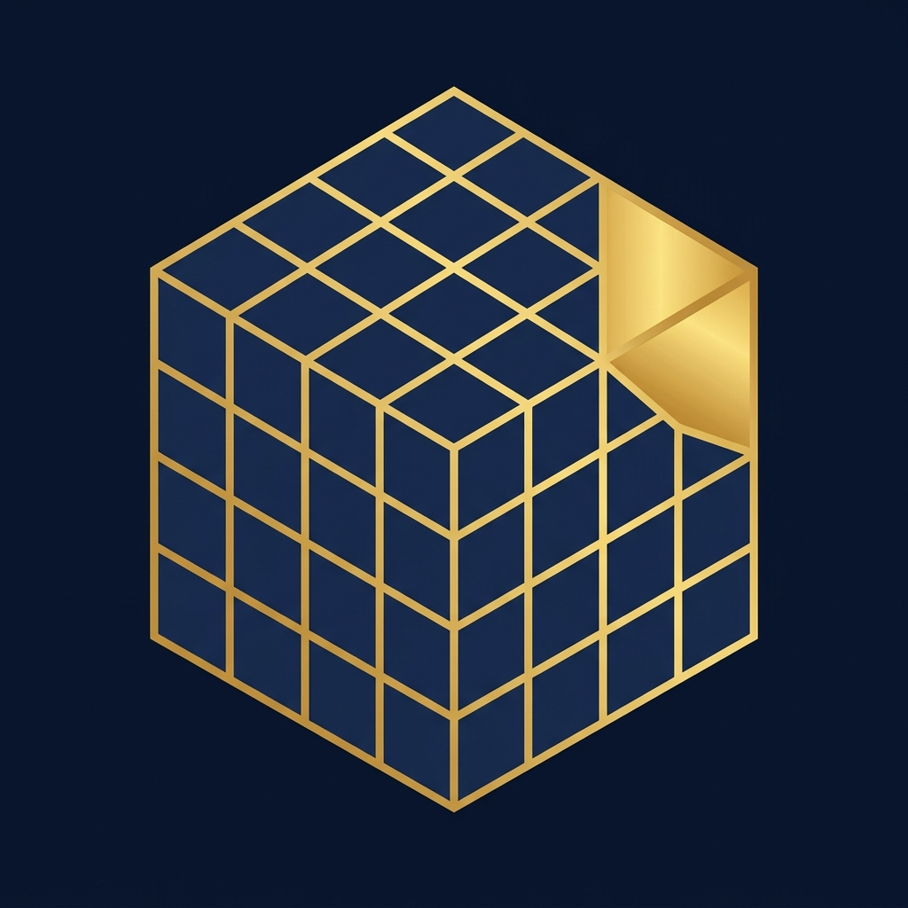

- **디자인 의미**: 데이터의 파편과 블록들이 맞물려 하나의 완성된 큐브를 이루며, 장인의 손길로 한쪽 면이 정교하게 다듬어지고 빛이 나는 형태입니다. "데이터를 유용한 도구로 가공한다"는 공방의 근본 철학을 직관적으로 표현합니다.
- **적용 추천**: 홈페이지 메인 헤더, 프로필 카드의 대표 심볼.
- **AI 생성 프롬프트**:
  ```text
  A high-end modern minimalist vector logo of a data cube. The cube is made of neatly fitting digital blocks, with one corner cleanly carved or polished by an artisan. Elegant flat design, clean geometric lines. Colors: deep navy blue (#0B132B) and glowing royal gold (#E5C158). Isolated on a solid dark background for corporate premium tech branding. No text, pure icon.
  ```

<!-- slide -->
### 2. 디지털 톱니바퀴 (The Digital Cogwheel)

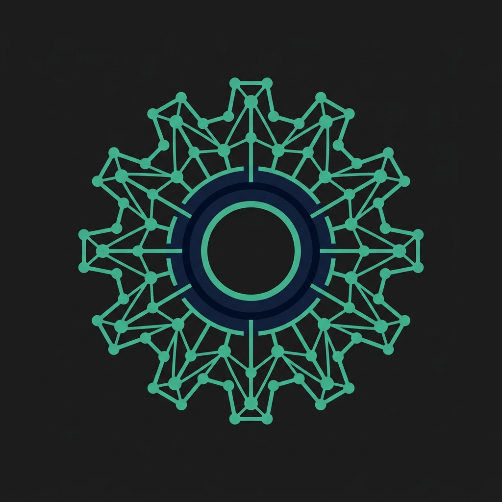

- **디자인 의미**: 톱니바퀴의 날 하나하나가 연결된 데이터 노드(Node)와 네트워크 링크(Link)로 형상화되어 있습니다. 실무 분석 기획과 자동화 최적화의 솔루션을 깎아내는 '데이터 공장'이자 '공방'의 역동적인 기계적 완성도를 보여줍니다.
- **적용 추천**: 커리큘럼(AI/AX, Python, Excel) 아이콘 및 교재 표지.
- **AI 생성 프롬프트**:
  ```text
  A premium minimalist vector logo of a modern cogwheel. The teeth of the cogwheel are made of digital data nodes (circles) and connections (lines). Clean flat design, elegant geometry. Colors: deep navy (#0B132B) and vibrant sage teal (#00A896). Isolated on a solid dark background for professional educational tech brand. No text, pure icon.
  ```

<!-- slide -->
### 3. 한글 모노그램 'ㄷ공' (Hangul Monogram 'DG')

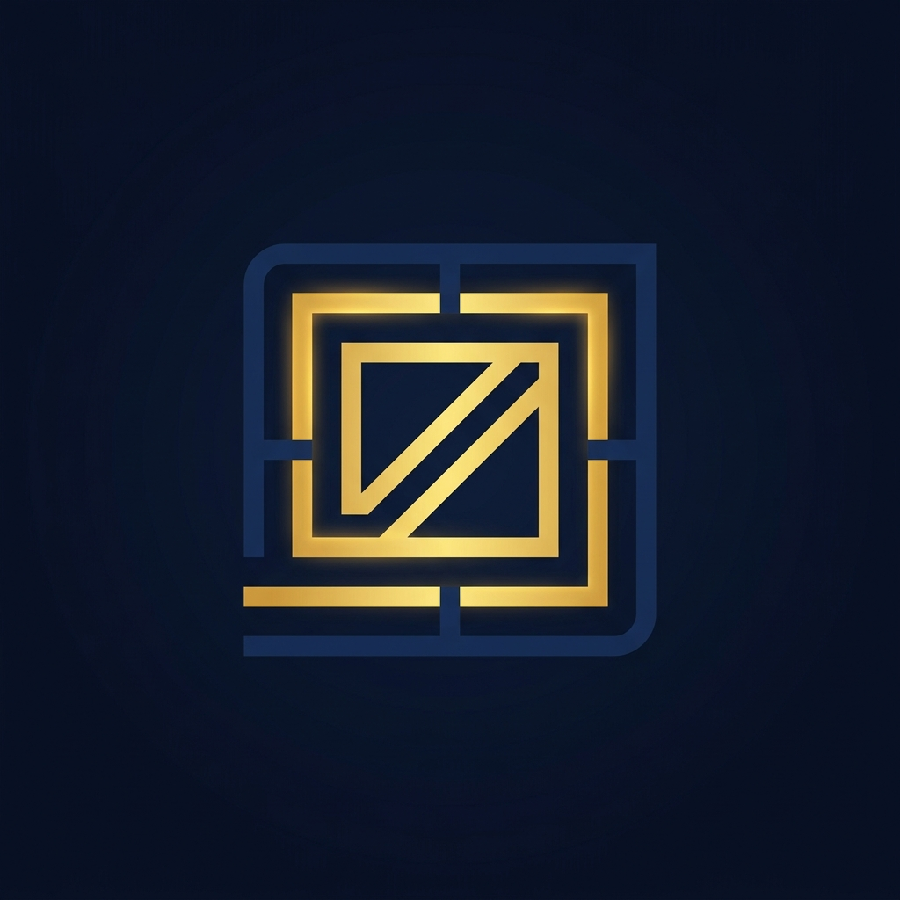

- **디자인 의미**: 한글 브랜드명 '데이터공방'의 초성인 'ㄷ'과 'ㄱ'을 하나의 연속적이고 미래지향적인 라인 아트로 결합했습니다. 로컬 브랜드로서의 명확한 정체성과 함께, 마치 하이테크 회로의 일부분을 연상시켜 지적 호기심을 유발합니다.
- **적용 추천**: 모바일 앱 아이콘, 파비콘(Favicon), 공식 인장 및 워터마크.
- **AI 생성 프롬프트**:
  ```text
  A high-end modern minimalist vector logo of a Hangul monogram representing Korean letters 'ㄷ' and 'ㄱ'. The letters are integrated into a sleek, clean geometric line art icon, resembling a modern block or circuit pattern. Colors: deep navy blue (#0B132B) and glowing royal gold (#E5C158). Flat vector design, dark solid background. No text, pure logo icon.
  ```

<!-- slide -->
### 4. 인공지능 대장간 (AI Forge)

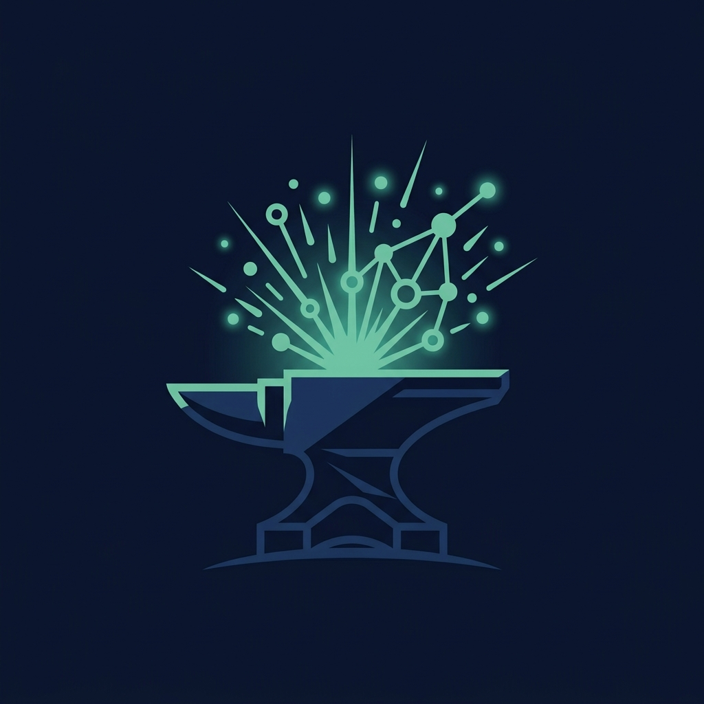

- **디자인 의미**: 대장간에서 단단한 쇠를 벼릴 때 사용하는 모루(Anvil)를 날카롭고 단순한 3D 라인으로 재해석하고, 그 서면에서 인공지능의 스파크와 데이터 신경망 노드가 환하게 피어오르는 비주얼입니다. 교육을 통해 수강생들의 비즈니스 체력을 강력하게 단련시킨다는 의미입니다.
- **적용 추천**: 오프라인 굿즈, 포스터, 발표 배경 장식.
- **AI 생성 프롬프트**:
  ```text
  A minimalist vector logo of a modern anvil. The anvil is drawn with clean abstract lines, and above it, a burst of bright glowing data sparks and network nodes is rising up. Colors: deep navy blue (#0B132B) and glowing sage teal (#00A896). Flat vector design, dark solid background. Professional corporate tech logo, no text, pure icon.
  ```

<!-- slide -->
### 5. 데이터 비트와 장인의 손 (Handcrafting Data)

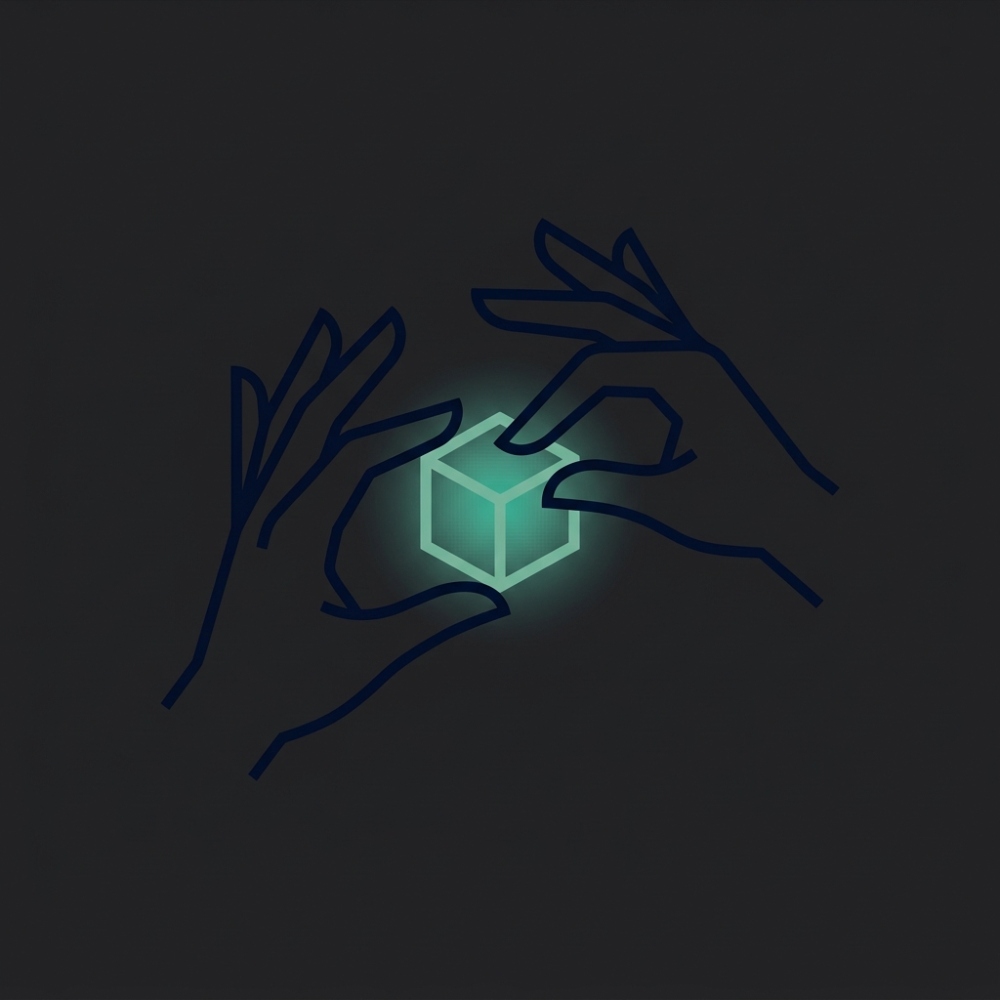

- **디자인 의미**: 인간 장인의 미니멀한 손이 데이터의 최소 단위인 비트 큐브를 공들여 조정하고 빚고 있는 모습입니다. 단순 지식 주입이 아닌, 강사와 수강생이 머리를 맞대고 '직접 만들어보는' 실습 중심의 가치를 극대화합니다.
- **적용 추천**: 블로그 배너 및 프로필 페이지, 강사 소개글 헤더.
- **AI 생성 프롬프트**:
  ```text
  A high-end minimalist vector logo showing a stylized outline of human hands carefully adjusting or holding a bright glowing pixel or data bit cube. Elegant geometric line art, flat design. Colors: deep navy blue (#0B132B) and soft sage teal (#00A896). Isolated on a solid dark background. Professional branding icon, no text.
  ```

<!-- slide -->
### 6. 기하학적 DGB 모노그램 (Continuous DGB)

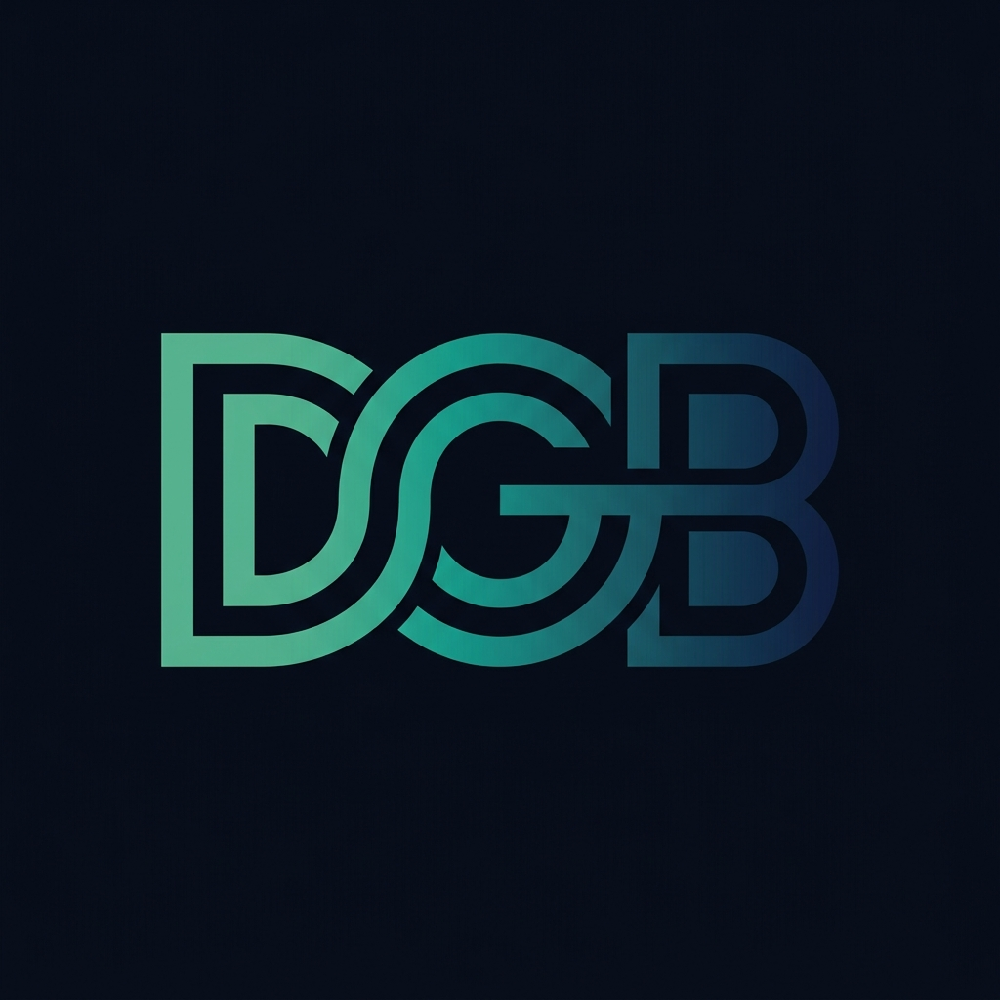

- **디자인 의미**: 영문 회사명 이니셜인 D, G, B가 하나의 끊어지지 않는 무한 궤도 루프로 연결되어 있습니다. 데이터 파이프라인의 물 흐르듯 유려한 이동과 데이터 분석을 통해 비즈니스 가치가 꼬리를 물고 연속적으로 성장하는 선순환을 은유합니다.
- **적용 추천**: 공식 명함, IR 자료 헤더, 회사 소개 PDF 레터헤드.
- **AI 생성 프롬프트**:
  ```text
  A high-end minimalist vector monogram logo of letters 'D', 'G', 'B' connected in a single continuous flowing line. Elegant geometric curves representing data flows and networks. Colors: deep navy blue (#0B132B) and vibrant sage teal (#00A896) gradient. Flat design, solid dark background. Corporate tech style, no text, pure icon.
  ```

<!-- slide -->
### 7. 인사이트 라이트하우스 (Insight Lighthouse)

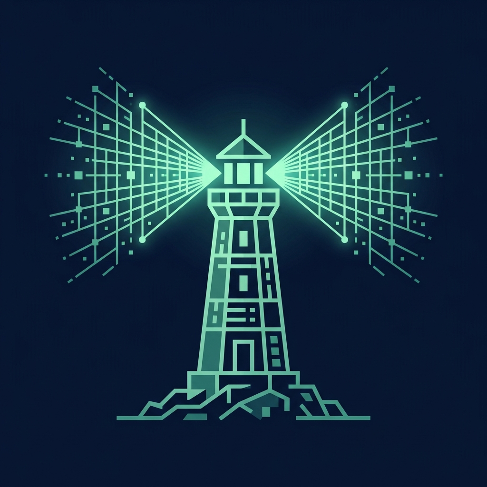

- **디자인 의미**: 데이터 블록으로 차곡차곡 쌓아 올린 견고한 등대가 어둠 속에서 인사이트의 빛줄기를 뻗어냅니다. 이 빛은 정렬된 데이터 그리드로 묘사되어, 복잡하고 어두운 비즈니스 의사결정의 바다에서 올바른 방향타를 제시하는 나침반과 등대 역할을 의미합니다.
- **적용 추천**: 컨설팅 제안서 리포트 표지, 홈페이지 CTA(문의하기) 배경 오브젝트.
- **AI 생성 프롬프트**:
  ```text
  A modern minimalist vector logo of a lighthouse. The lighthouse is constructed from clean geometric data blocks, and its light beam is depicted as a structured, expanding grid of data lines illuminating the darkness. Colors: deep navy blue (#0B132B) and glowing sage teal (#00A896). Flat vector design, solid dark background, no text, pure branding icon.
  ```

<!-- slide -->
### 8. 디지털 나이테 (Digital Tree Rings)

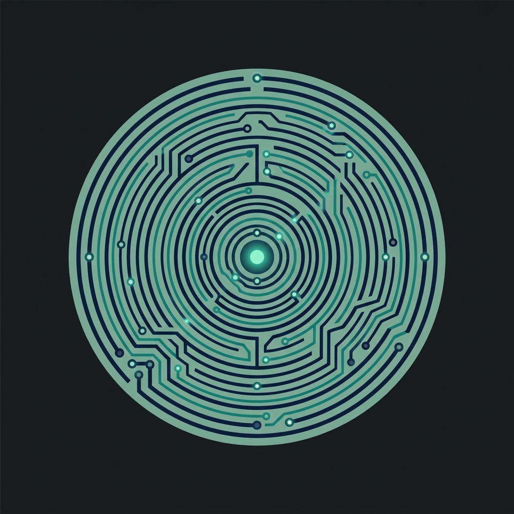

- **디자인 의미**: 나무의 연륜과 성장을 증명하는 나이테를 미세한 전자회로 라인과 노드로 표현하여 아날로그적인 따뜻함과 최첨단 인공지능 분석 기법을 통합했습니다. 오랜 실무 경험(16년 차)과 교육생들이 단계를 밟아가며 성장하는 레이어를 시각화합니다.
- **적용 추천**: 기획 연구 자료, 리포지토리 대표 커버 이미지.
- **AI 생성 프롬프트**:
  ```text
  A high-end modern minimalist vector logo inspired by wood tree rings. The tree rings are re-imagined as concentric, circular electronic circuit board patterns with small glowing nodes. Colors: dark charcoal gray (#121212) background, with deep navy blue (#0B132B) and sage teal (#00A896) lines. Flat design, clean geometry. Corporate tech logo, no text, pure icon.
  ```

<!-- slide -->
### 9. 정밀 데이터 조각 (Precision Data Sculpture)

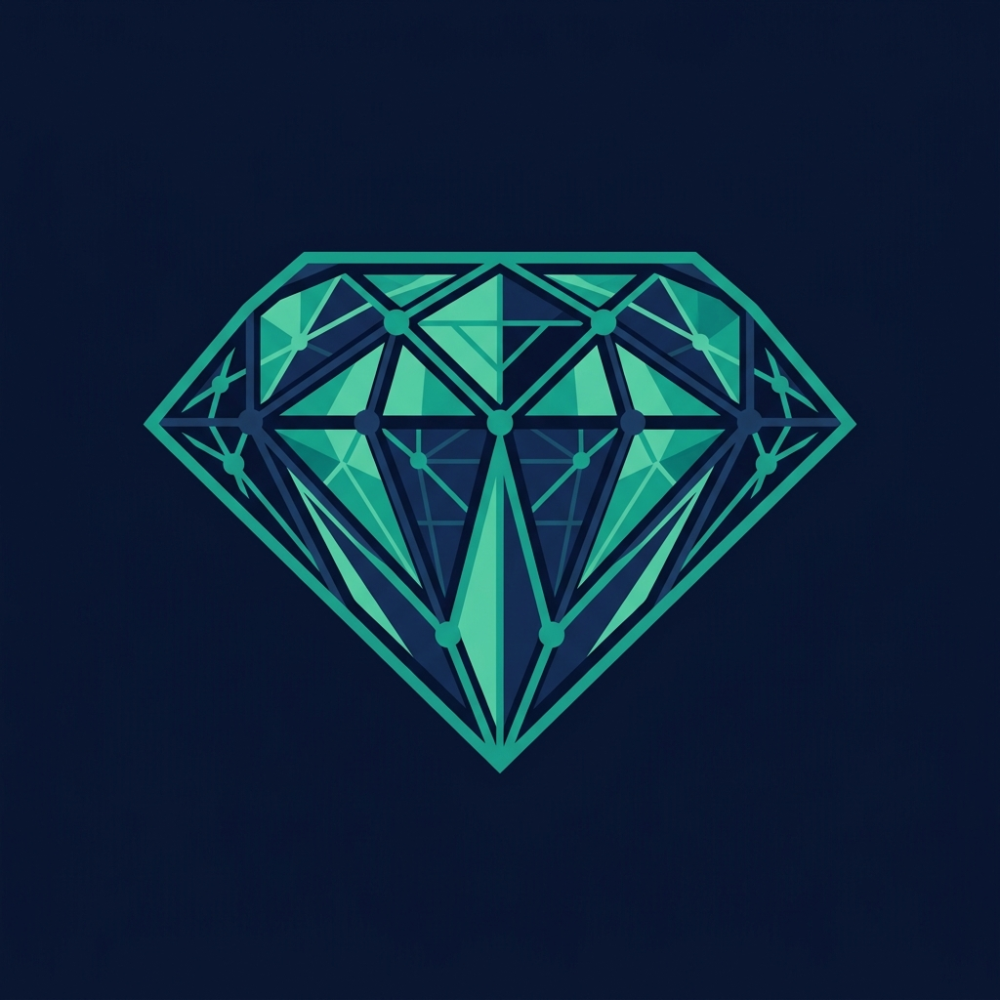

- **디자인 의미**: 거칠고 다듬어지지 않은 원석(Raw Data)이 공방 장인의 기하학적 분석/정제 기술을 거쳐 빛나는 다이아몬드 결정(Insight)으로 조각되는 시간을 담은 플랫 엠블럼입니다. 고부가가치를 지닌 데이터를 가공하는 지적인 기술을 강조합니다.
- **적용 추천**: 프리미엄 CEO 과정 브로슈어, VIP 교육용 템플릿.
- **AI 생성 프롬프트**:
  ```text
  A premium minimalist vector logo of a geometric diamond or gemstone. The facets of the diamond are shaped like interconnected data polygons and grid planes, showing raw data carved into a polished jewel. Colors: deep navy blue (#0B132B) and vibrant sage teal (#00A896). Flat design, clean lines, solid dark background. Corporate tech educational icon, no text, pure emblem.
  ```

<!-- slide -->
### 10. 인터랙티브 노드 웨이브 (Interactive Node Wave)

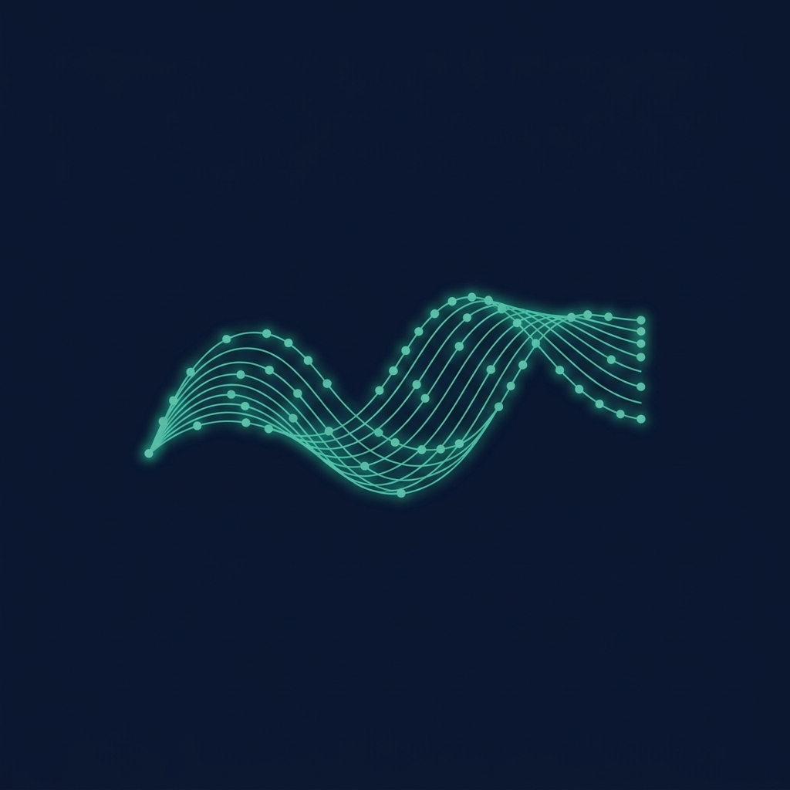

- **디자인 의미**: 물결치며 뻗어 나가는 파동의 형태가 개별 데이터 노드(Point)와 선의 유연한 파형으로 표현됩니다. 변화하는 IT 교육 시장에 대한 유연한 대처, 수강생의 수준에 맞춰 페이스와 장르를 완급 조절하는 '소통의 웨이브'를 뜻합니다.
- **적용 추천**: 홈페이지 Hero 섹션 배경 그래픽, 커뮤니케이션 양식.
- **AI 생성 프롬프트**:
  ```text
  A high-end minimalist vector logo of a wave pattern. The wave is formed by a series of glowing data nodes (points) and thin flowing connection lines, waving gracefully. Colors: deep navy blue (#0B132B) and glowing sage teal (#00A896). Flat design, clean lines, solid dark background. Professional educational brand icon, no text.
  ```

<!-- slide -->
### 11. 수평 연결 모노그램 'ㄷㄱ' (Horizontal Continuous 'DG')

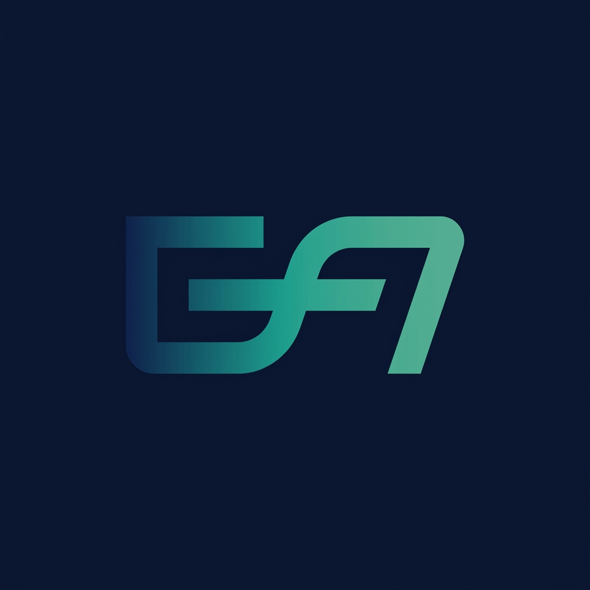

- **디자인 의미**: 한글 초성 'ㄷ'과 'ㄱ'을 하나의 유기적인 수평선으로 연결한 미니멀 디자인입니다. 'ㄷ'의 오른쪽 빈 공간과 'ㄱ'의 왼쪽 시작점이 자연스러운 굴곡을 그리며 흐르듯 연결되어 데이터의 수집부터 정제, 인사이트 도출까지의 매끄러운 흐름을 시각화합니다. 가장 고도로 단순화된 디자인으로 전문적인 테크 브랜드 이미지를 강화합니다.
- **적용 추천**: 홈페이지 파비콘(Favicon), 모바일 최적화 헤더, 미니멀 사내 문서 포맷.
- **AI 생성 프롬프트**:
  ```text
  A high-end modern minimalist vector logo showing the Korean letters 'ㄷ' and 'ㄱ' connected side by side by a single continuous line. The letter 'ㄷ' smoothly flows into 'ㄱ' horizontally, creating a sleek geometric pipeline or infinity-like waveform. Minimalist flat design, sharp clean lines. Colors: deep navy blue (#0B132B) and vibrant sage teal (#00A896) gradient. Isolated on a solid dark navy background. Professional corporate tech branding, no text, pure icon.
  ```
```

---

## 📂 파트 2. 사용자 피드백 스케치 고도화 제안 5종
사용자께서 직접 제안해 주신 **1) 'ㄷ'과 'ㄱ'의 수평 결합 레이아웃**과 **2) 'ㄷ' 내부에 'ㄱ'이 삽입되는 중첩 결합 레이아웃**을 바탕으로, 테크니컬 디자인 관점에서 심미성과 입체감을 극대화하여 5가지 서로 다른 스타일로 변환 및 고도화한 버전입니다.

```carousel
### 버전 1. 수평 결합 입체 데이터 파이프라인 (Flat 3D Pipeline 'ㄷㄱ')

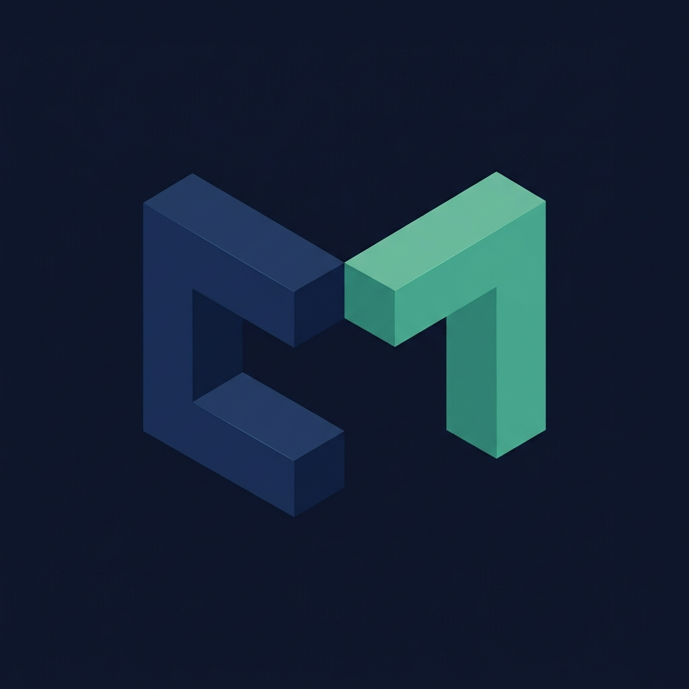

- **디자인 의미**: 사용자가 제안한 1안(수평 연결)을 기반으로, 평면적인 2D 형태를 전문적인 3D 아이소메트릭(Isometric) 블록 파이프라인 형태로 고도화했습니다. 왼쪽 'ㄷ'에서 시작한 굵은 블루 라인이 입체적인 깊이감을 그리며 꺾이고, 오른쪽 'ㄱ'의 네온 틸 큐브 라인으로 정교하게 확장되어 뻗어 나갑니다. 데이터가 수집 및 가공되는 흐름이 매끄러운 단일 파이프라인을 타고 최종 비즈니스 결과물로 출력되는 최적화 과정을 대변합니다.
- **AI 생성 프롬프트**:
  ```text
  A high-end modern minimalist vector logo. It represents Korean letters 'ㄷ' and 'ㄱ' connected side-by-side horizontally. The letters are styled as a clean 3D isometric block or pipeline with elegant depth. The left 'ㄷ' is solid deep navy blue (#0B132B) and the right 'ㄱ' is vibrant sage teal (#00A896). Flat 3D design, clean geometric edges, isolated on a solid dark navy background. Professional tech branding, no text.
  ```

<!-- slide -->
### 버전 2. 감싸 안은 데이터 아카이브 (Nested Archive 'ㄷㄱ')

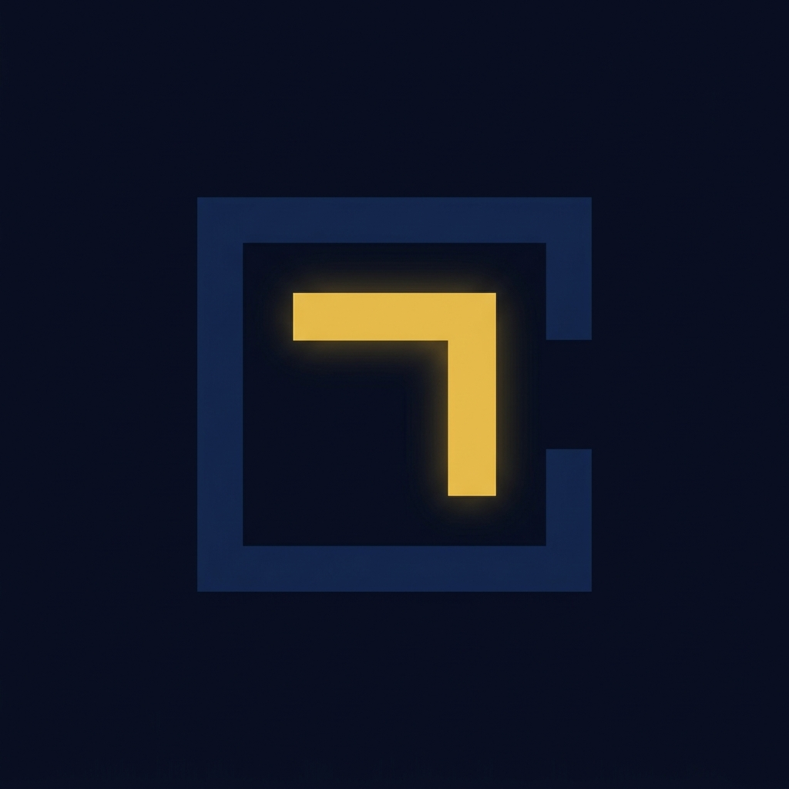

- **디자인 의미**: 사용자가 제안한 2안(ㄷ 안에 ㄱ이 삽입되는 중첩 결합)을 기하학적이고 대칭성이 뛰어난 모던 엠블럼으로 고도화했습니다. 외곽을 감싸는 커다란 'ㄷ'은 단단하고 신뢰감 있는 딥 블루 프레임이며, 그 내부 공간의 코어에 'ㄱ' 형태의 골드 블록이 원석처럼 견고하게 결합되어 들어앉아 있습니다. 데이터의 안전한 수용과 분석 프레임워크 안에, 정교하게 단련된 비즈니스 통찰이자 핵심 기술(ㄱ)을 견고하게 보관하고 아카이빙한다는 장인의 기술력을 상징합니다.
- **AI 생성 프롬프트**:
  ```text
  A premium minimalist vector logo based on Korean letters 'ㄷ' and 'ㄱ'. The larger outer frame is shape 'ㄷ' in deep navy blue (#0B132B), and inside it, a smaller shape 'ㄱ' in vibrant glowing royal gold (#E5C158) is nested and locked in. Clean geometric lines, flat design, modern tech aesthetic. Isolated on a solid dark navy background. Professional branding icon, no text.
  ```

<!-- slide -->
### 버전 3. 네온 회로보드 플로우 (Neon Circuit 'ㄷㄱ')

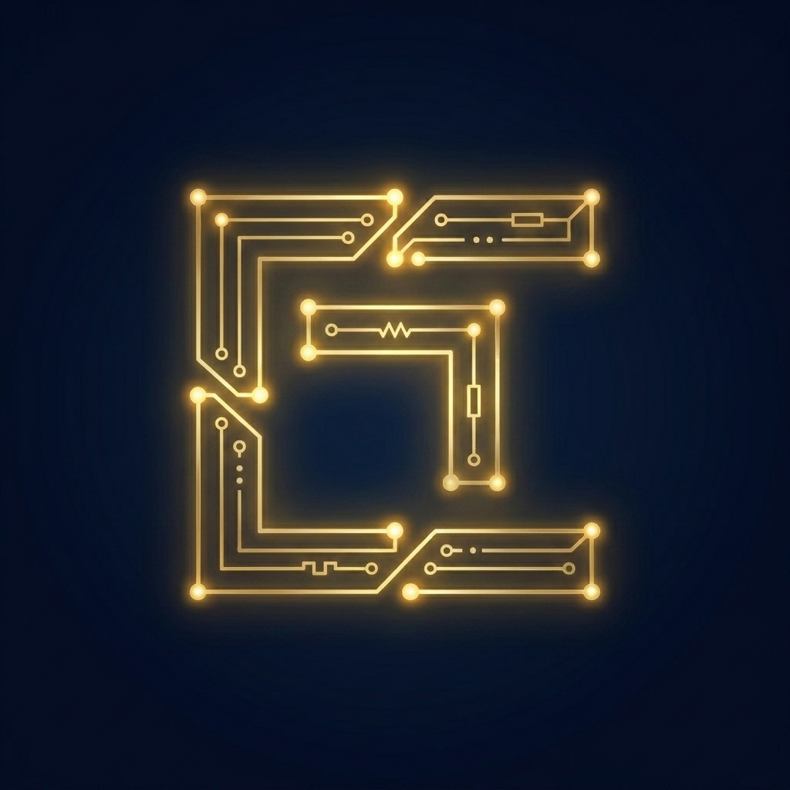

- **디자인 의미**: 사용자가 제안한 2안의 기하학적 형태를 인공지능(AI) 신경망 및 전자회로 기판의 마이크로 트랙(Micro Track) 형태로 변형했습니다. 얇고 극도로 정교한 골드 네온 라인들이 ㄷ과 ㄱ의 형태를 유기적으로 흘러가며, 미세한 원형의 노드 포인트들이 각 접점에서 영롱하게 빛납니다. 데이터공방의 AX(인공지능 전환) 및 AI Survival 트랙을 상징하며, 정밀하고 빈틈없는 논리를 기반으로 작동하는 IT 실무 교육의 핵심을 시각화합니다.
- **AI 생성 프롬프트**:
  ```text
  A modern minimalist vector logo showing the nested Korean letters 'ㄷ' and 'ㄱ' as a glowing electronic circuit board design. The outer 'ㄷ' and inner 'ㄱ' are drawn with thin glowing neon lines and small connection nodes. Colors: deep navy background, bright electric royal gold (#E5C158) neon glow lines. Clean wireframe flat tech design. No text, pure corporate icon.
  ```


<!-- slide -->
### 버전 4. 글래스모피즘 키 로고 (Glassmorphism Key 'ㄷㄱ')

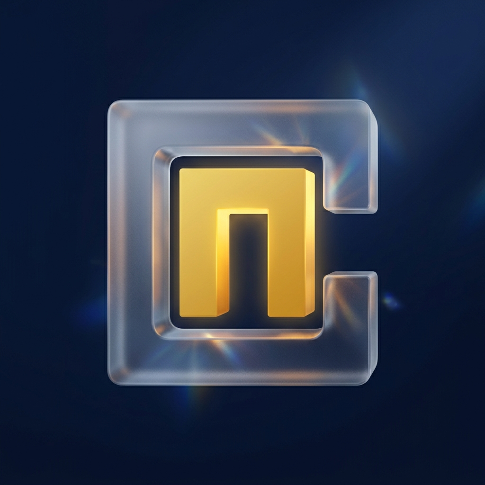

- **디자인 의미**: ㄷ과 ㄱ의 결합 구조가 알파벳 'G'(Gongbang) 또는 문제를 해결하는 '열쇠(Key)'와 유사하다는 점에서 착안했습니다. 홈페이지 메인 디자인 콘셉트인 글래스모피즘(Glassmorphism)을 직접 차용하여, 외곽의 'ㄷ'은 반투명하고 뽀얀 모서리 라운드 유리의 질감을 지녔으며, 그 뒤에 입체적으로 빛나는 솔리드한 골드 컬러의 'ㄱ' 조각이 열쇠의 톱니처럼 맞물려 있습니다. 데이터공방이 수강생과 비즈니스 고객에게 제공하는 "데이터 문제 해결을 위한 마스터 키(Master Key)"와 트렌디한 프론트엔드 테크 감각을 의미합니다.
- **AI 생성 프롬프트**:
  ```text
  A premium 3D graphic logo in glassmorphism style. The outer frame is a semi-transparent glass 'ㄷ' shape with frosted texture and soft blur, and inside it, a solid glowing 3D 'ㄱ' block in vibrant royal gold (#E5C158) fits perfectly like a key. Colors: deep navy blue background (#0B132B), light refractions, sleek and high-end. Professional corporate branding icon, no text.
  ```

<!-- slide -->
### 버전 5. 무한대 곡선 연결 (Infinite Continuous Line 'ㄷㄱ')

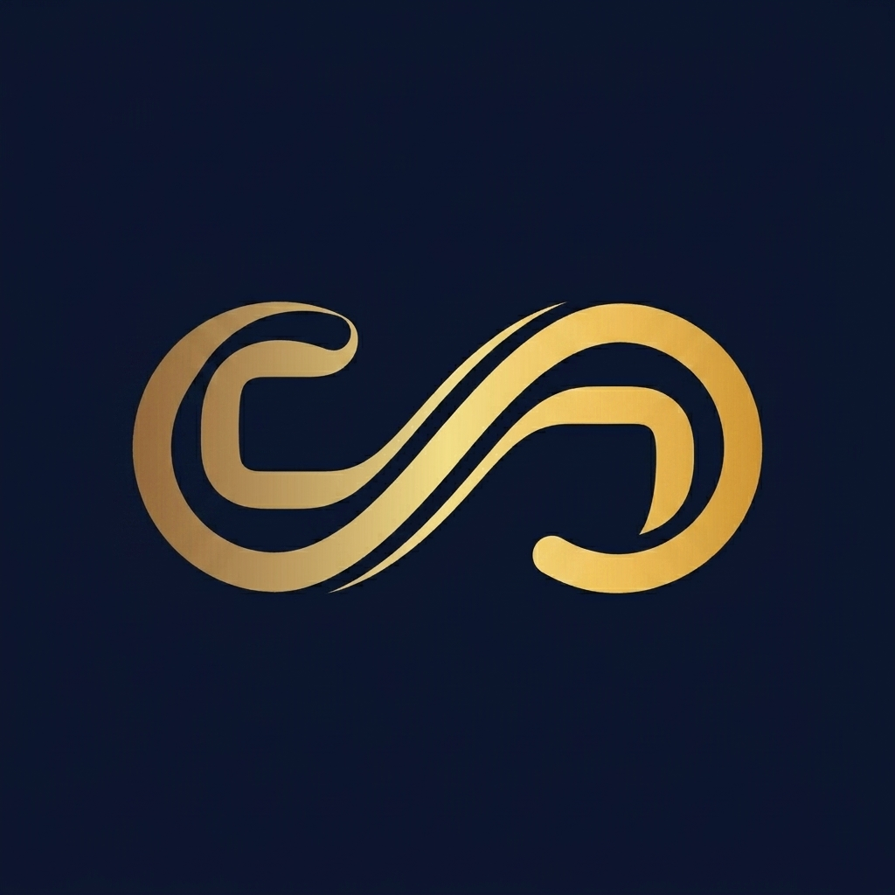

- **디자인 의미**: 사용자가 제안한 1안(수평 연결)의 직선적이고 다소 딱딱할 수 있는 꺾임 선들을 유연하고 유기적인 곡선(Organic Curvature)으로 특화했습니다. 'ㄷ'의 곡선 꼬리가 뫼비우스의 띠처럼 물결치며 뻗어 나가 'ㄱ'의 상단으로 매끄럽게 흡수되어, 전체적으로 하나의 세련된 무한대 기호(∞) 또는 부드러운 파형을 이룹니다. 멈추지 않고 지속 가능한 데이터 라이프사이클(수집-가공-분석-피드백)과 교육자와 수강생 간의 부드럽고 유연한 소통, 그리고 영속적인 비즈니스 성장을 상징합니다.
- **AI 생성 프롬프트**:
  ```text
  A high-end modern minimalist vector logo showing Korean letters 'ㄷ' and 'ㄱ' connected horizontally. The straight lines are re-imagined as sleek, organic continuous curves forming a single flowing wave or infinity loop. Colors: deep navy blue (#0B132B) and glowing royal gold (#E5C158) gradient. Flat design, clean lines, isolated on a solid dark background. No text, pure branding icon.
  ```

```

---

## 🛠️ 로고 홈페이지 연동 및 사용 가이드라인

1. **컬러 매칭 가이드**:
   - 로고들은 기본적으로 공식 홈페이지의 메인 배경색인 딥 네이비(`#060B19` / `#0B132B`) 및 페이지 테마인 `#C5A880` 로얄 골드 그라데이션과 자연스럽게 녹아들도록 설계되어 있습니다.
   - 투명 배경으로 변환하여 사용하거나, `mix-blend-mode: screen` 또는 `opacity` 제어를 통해 홈페이지의 글래스모피즘 카드 내부에 배치했을 때 시인성이 뛰어납니다.


2. **홈페이지 헤더 적용 방법**:
   - `index.html` 의 로고 텍스트 영역(`<span class="logo-text">데이터공방</span>`) 옆에 선택한 로고 아이콘을 결합하여 브랜딩의 밀도를 높일 수 있습니다.
   - 예시:
     ```html
     <div class="logo-container">
       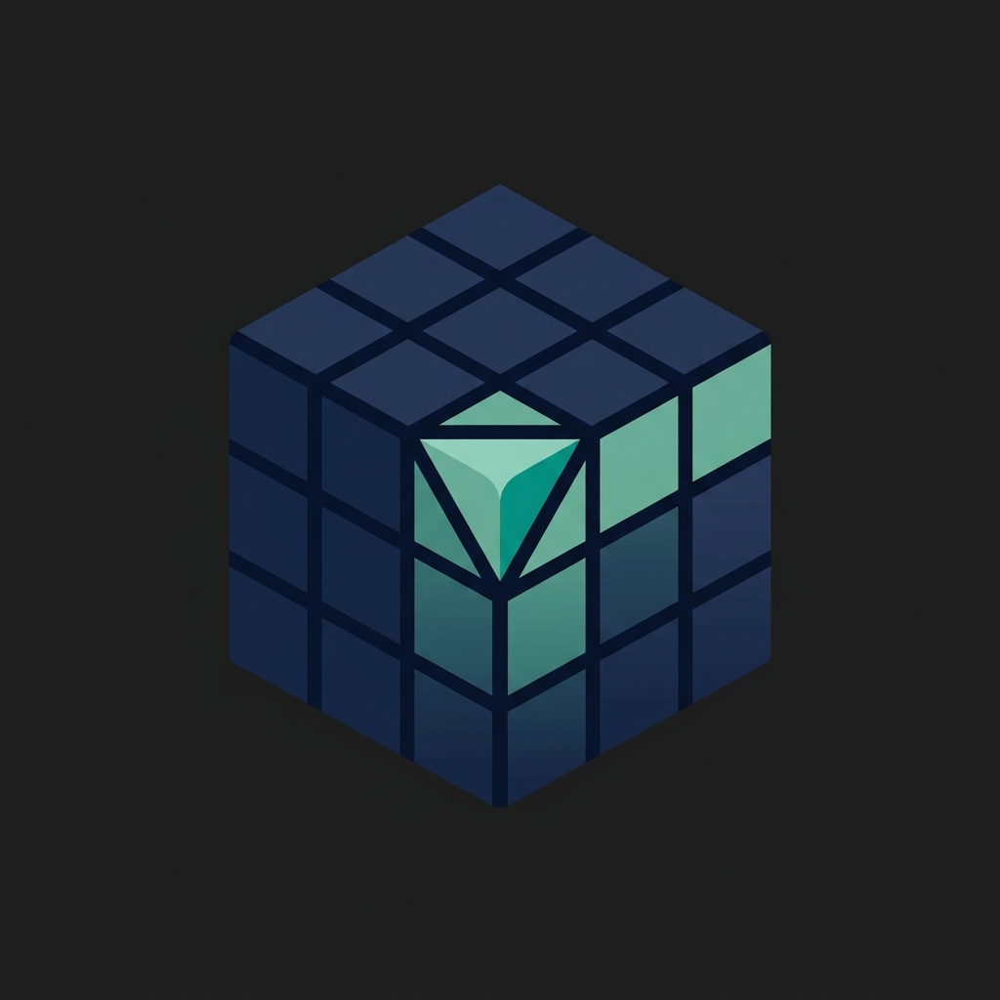
       <span class="logo-text">데이터공방</span>
     </div>
     ```

3. **향후 브랜딩 확장 (스킬셋 연계)**:
   - **`canvas-design`**: 본 로고들을 기반으로 브로슈어, 명함, 강의계획서 PDF의 디자인 템플릿 레이아웃을 생성할 수 있습니다.
   - **`screenshots`**: 최종 로고를 웹사이트에 연동한 뒤, Playwright 스킬을 이용하여 깃허브나 SNS 홍보용 마케팅 스크린샷을 자동 생성할 수 있습니다.
